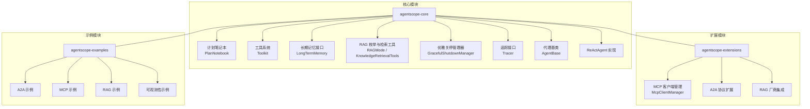
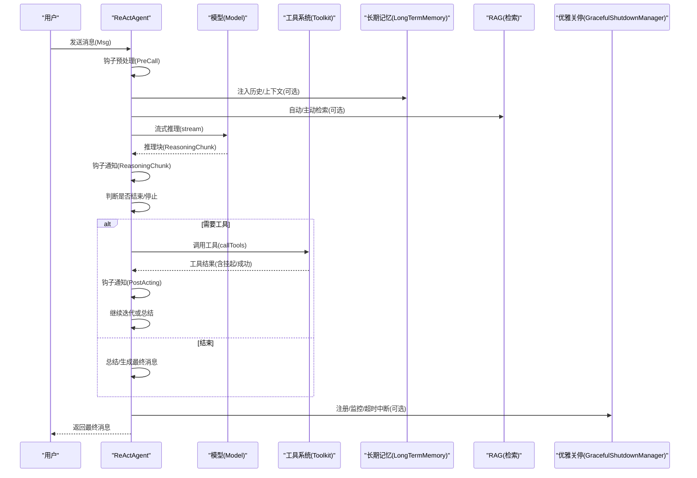
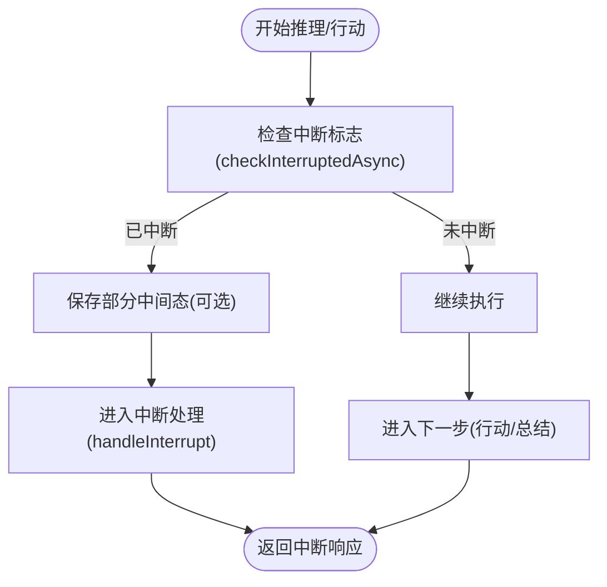
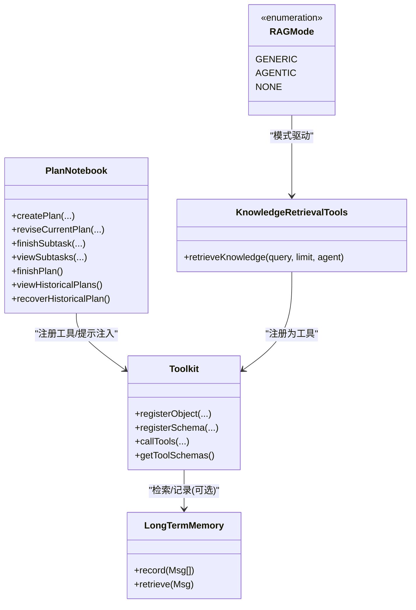
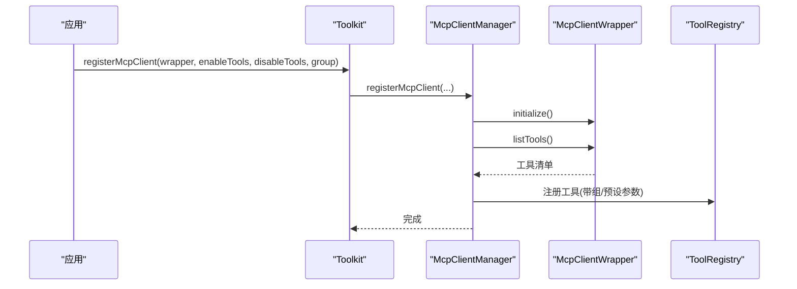
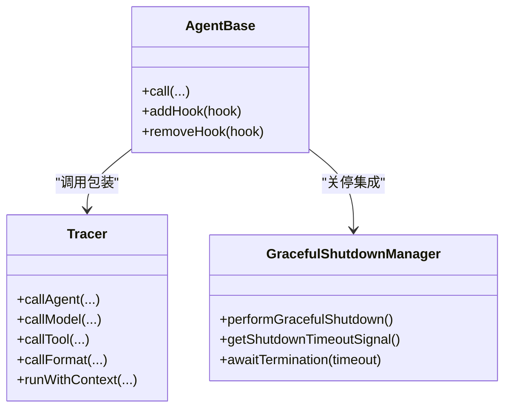
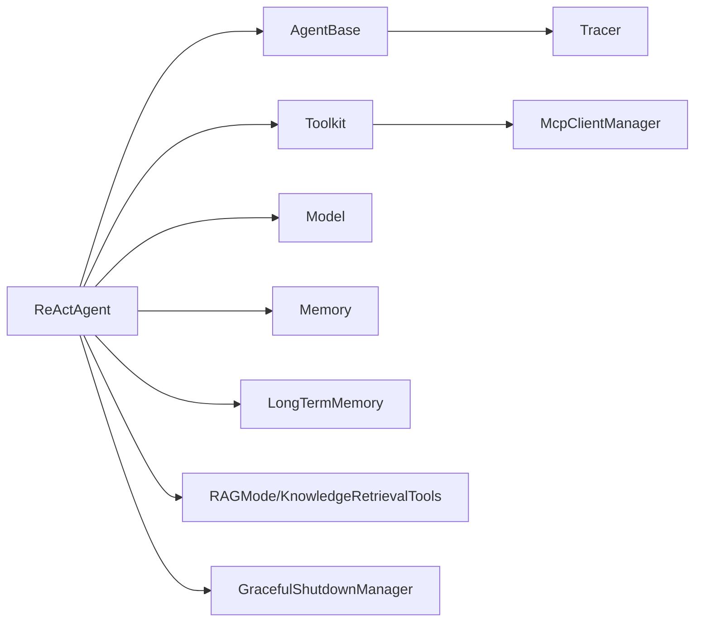

# 核心特性

<cite>
**本文引用的文件**
- [PlanNotebook.java](file://agentscope-core/src/main/java/io/agentscope/core/plan/PlanNotebook.java)
- [LongTermMemory.java](file://agentscope-core/src/main/java/io/agentscope/core/memory/LongTermMemory.java)
- [Toolkit.java](file://agentscope-core/src/main/java/io/agentscope/core/tool/Toolkit.java)
- [McpClientManager.java](file://agentscope-core/src/main/java/io/agentscope/core/tool/McpClientManager.java)
- [RAGMode.java](file://agentscope-core/src/main/java/io/agentscope/core/rag/RAGMode.java)
- [KnowledgeRetrievalTools.java](file://agentscope-core/src/main/java/io/agentscope/core/rag/KnowledgeRetrievalTools.java)
- [GracefulShutdownManager.java](file://agentscope-core/src/main/java/io/agentscope/core/shutdown/GracefulShutdownManager.java)
- [Tracer.java](file://agentscope-core/src/main/java/io/agentscope/core/tracing/Tracer.java)
- [AgentBase.java](file://agentscope-core/src/main/java/io/agentscope/core/agent/AgentBase.java)
- [ReActAgent.java](file://agentscope-core/src/main/java/io/agentscope/core/ReActAgent.java)
- [ObservableAgent.java](file://agentscope-core/src/main/java/io/agentscope/core/agent/ObservableAgent.java)
</cite>

## 目录
1. [引言](#引言)
2. [项目结构](#项目结构)
3. [核心组件](#核心组件)
4. [架构总览](#架构总览)
5. [详细组件分析](#详细组件分析)
6. [依赖关系分析](#依赖关系分析)
7. [性能考量](#性能考量)
8. [故障排查指南](#故障排查指南)
9. [结论](#结论)
10. [附录](#附录)

## 引言
本文件面向希望在生产环境中构建稳定、可扩展、可观测的多智能体应用的工程师与架构师，系统性阐述 AgentScope Java 框架的五大核心特性：智能代理控制（安全中断、优雅停机、人机协同）、内置工具系统（计划笔记本、结构化输出、长期记忆、检索增强）、无缝集成能力（MCP 协议、A2A 协议）、生产级特性（高性能、安全沙箱、可观测性）。我们将从代码结构、数据流、处理逻辑、集成点与错误处理等维度进行深入剖析，并给出使用场景、配置要点与示例路径，帮助读者理解各特性如何协同工作以支撑端到端的生产级 AI 应用。

## 项目结构
AgentScope Java 将“智能体内核”与“扩展生态”清晰分层：
- 核心模块（agentscope-core）：定义 Agent 生命周期、消息模型、工具系统、Hook 机制、内存与状态管理、RAG、可观测性与关停策略等基础设施。
- 扩展模块（agentscope-extensions）：提供与外部系统的对接（如 Nacos、RocketMQ、RAG 各厂商实现等）。
- 示例模块（agentscope-examples）：覆盖 A2A、MCP、RAG、长时记忆、Langfuse 观察等典型用法。
- 外部集成（agentscope-extensions-*）：Spring Boot Starter、Quarkus/Micronaut 扩展、训练/调度/会话存储等。

图示来源
- [PlanNotebook.java](file://agentscope-core/src/main/java/io/agentscope/core/plan/PlanNotebook.java)
- [Toolkit.java](file://agentscope-core/src/main/java/io/agentscope/core/tool/Toolkit.java)
- [LongTermMemory.java](file://agentscope-core/src/main/java/io/agentscope/core/memory/LongTermMemory.java)
- [RAGMode.java](file://agentscope-core/src/main/java/io/agentscope/core/rag/RAGMode.java)
- [KnowledgeRetrievalTools.java](file://agentscope-core/src/main/java/io/agentscope/core/rag/KnowledgeRetrievalTools.java)
- [GracefulShutdownManager.java](file://agentscope-core/src/main/java/io/agentscope/core/shutdown/GracefulShutdownManager.java)
- [Tracer.java](file://agentscope-core/src/main/java/io/agentscope/core/tracing/Tracer.java)
- [AgentBase.java](file://agentscope-core/src/main/java/io/agentscope/core/agent/AgentBase.java)
- [ReActAgent.java](file://agentscope-core/src/main/java/io/agentscope/core/ReActAgent.java)
- [McpClientManager.java](file://agentscope-core/src/main/java/io/agentscope/core/tool/McpClientManager.java)

章节来源
- [PlanNotebook.java](file://agentscope-core/src/main/java/io/agentscope/core/plan/PlanNotebook.java)
- [Toolkit.java](file://agentscope-core/src/main/java/io/agentscope/core/tool/Toolkit.java)
- [LongTermMemory.java](file://agentscope-core/src/main/java/io/agentscope/core/memory/LongTermMemory.java)
- [RAGMode.java](file://agentscope-core/src/main/java/io/agentscope/core/rag/RAGMode.java)
- [KnowledgeRetrievalTools.java](file://agentscope-core/src/main/java/io/agentscope/core/rag/KnowledgeRetrievalTools.java)
- [GracefulShutdownManager.java](file://agentscope-core/src/main/java/io/agentscope/core/shutdown/GracefulShutdownManager.java)
- [Tracer.java](file://agentscope-core/src/main/java/io/agentscope/core/tracing/Tracer.java)
- [AgentBase.java](file://agentscope-core/src/main/java/io/agentscope/core/agent/AgentBase.java)
- [ReActAgent.java](file://agentscope-core/src/main/java/io/agentscope/core/ReActAgent.java)
- [McpClientManager.java](file://agentscope-core/src/main/java/io/agentscope/core/tool/McpClientManager.java)

## 核心组件
- 智能代理控制：基于 Reactive 的中断与关停机制，支持用户/系统中断、优雅关停、请求跟踪与可观测性。
- 内置工具系统：统一的工具注册、执行、分组与模式化参数生成；支持 MCP 客户端动态接入与外部工具桥接。
- 无缝集成能力：MCP 协议客户端生命周期管理；A2A 协议通过扩展模块与消息总线对接。
- 生产级特性：高性能（Reactor 非阻塞）、安全沙箱（待扩展）、可观测性（Tracer 接口与 Hook 事件链路）。

章节来源
- [AgentBase.java](file://agentscope-core/src/main/java/io/agentscope/core/agent/AgentBase.java)
- [GracefulShutdownManager.java](file://agentscope-core/src/main/java/io/agentscope/core/shutdown/GracefulShutdownManager.java)
- [Toolkit.java](file://agentscope-core/src/main/java/io/agentscope/core/tool/Toolkit.java)
- [McpClientManager.java](file://agentscope-core/src/main/java/io/agentscope/core/tool/McpClientManager.java)
- [Tracer.java](file://agentscope-core/src/main/java/io/agentscope/core/tracing/Tracer.java)

## 架构总览
AgentScope 的运行时由“代理内核 + 工具系统 + 记忆与状态 + RAG + 观测与关停”构成。ReActAgent 作为典型实现，串联“推理-行动-钩子-工具-模型”的闭环；同时通过 Hook 与 Tracer 提供可观测性与可控性。

图示来源
- [ReActAgent.java](file://agentscope-core/src/main/java/io/agentscope/core/ReActAgent.java)
- [AgentBase.java](file://agentscope-core/src/main/java/io/agentscope/core/agent/AgentBase.java)
- [Toolkit.java](file://agentscope-core/src/main/java/io/agentscope/core/tool/Toolkit.java)
- [LongTermMemory.java](file://agentscope-core/src/main/java/io/agentscope/core/memory/LongTermMemory.java)
- [RAGMode.java](file://agentscope-core/src/main/java/io/agentscope/core/rag/RAGMode.java)
- [GracefulShutdownManager.java](file://agentscope-core/src/main/java/io/agentscope/core/shutdown/GracefulShutdownManager.java)

## 详细组件分析

### 特性一：智能代理控制（安全中断、优雅停机、人机协同）
- 安全中断（Interrupt）：AgentBase 提供中断标志位与检查点，ReActAgent 在推理/行动关键节点调用异步中断检查，抛出 InterruptedException 并进入恢复流程。
- 优雅停机（Graceful Shutdown）：全局管理器跟踪活跃请求、设置超时信号并强制中断；支持系统源与用户源中断；与会话绑定以便恢复。
- 人机协同（HITL）：通过 PostReasoningEvent/PostActingEvent 的 stopAgent 请求，允许人类干预中止当前步骤或流程。

图示来源
- [AgentBase.java](file://agentscope-core/src/main/java/io/agentscope/core/agent/AgentBase.java)
- [ReActAgent.java](file://agentscope-core/src/main/java/io/agentscope/core/ReActAgent.java)
- [GracefulShutdownManager.java](file://agentscope-core/src/main/java/io/agentscope/core/shutdown/GracefulShutdownManager.java)

章节来源
- [AgentBase.java](file://agentscope-core/src/main/java/io/agentscope/core/agent/AgentBase.java)
- [ReActAgent.java](file://agentscope-core/src/main/java/io/agentscope/core/ReActAgent.java)
- [GracefulShutdownManager.java](file://agentscope-core/src/main/java/io/agentscope/core/shutdown/GracefulShutdownManager.java)

### 特性二：内置工具系统（计划笔记本、结构化输出、长期记忆、RAG）
- 计划笔记本（PlanNotebook）：提供创建/修订/完成计划与子任务、自动注入提示、状态持久化与历史恢复的工具集；支持最大子任务数限制与用户确认规则。
- 结构化输出（Structured Output）：ReActAgent 通过 StructuredOutputCapableAgent 支持类型化输出与提醒机制，结合 Hook 实现“先推理再输出”的约束。
- 长期记忆（LongTermMemory）：抽象接口定义记录与检索能力；ReActAgent 可按模式注入静态/双向控制；扩展模块提供多种实现（Mem0、AutoContext 等）。
- RAG：枚举定义通用/代理主导两种模式；通用模式通过 Hook 自动注入检索结果；代理主导模式通过工具函数触发检索。

图示来源
- [PlanNotebook.java](file://agentscope-core/src/main/java/io/agentscope/core/plan/PlanNotebook.java)
- [Toolkit.java](file://agentscope-core/src/main/java/io/agentscope/core/tool/Toolkit.java)
- [LongTermMemory.java](file://agentscope-core/src/main/java/io/agentscope/core/memory/LongTermMemory.java)
- [KnowledgeRetrievalTools.java](file://agentscope-core/src/main/java/io/agentscope/core/rag/KnowledgeRetrievalTools.java)
- [RAGMode.java](file://agentscope-core/src/main/java/io/agentscope/core/rag/RAGMode.java)

章节来源
- [PlanNotebook.java](file://agentscope-core/src/main/java/io/agentscope/core/plan/PlanNotebook.java)
- [Toolkit.java](file://agentscope-core/src/main/java/io/agentscope/core/tool/Toolkit.java)
- [LongTermMemory.java](file://agentscope-core/src/main/java/io/agentscope/core/memory/LongTermMemory.java)
- [RAGMode.java](file://agentscope-core/src/main/java/io/agentscope/core/rag/RAGMode.java)
- [KnowledgeRetrievalTools.java](file://agentscope-core/src/main/java/io/agentscope/core/rag/KnowledgeRetrievalTools.java)

### 特性三：无缝集成能力（MCP 协议、A2A 协议）
- MCP（Model Context Protocol）：McpClientManager 负责客户端初始化、工具列表拉取、过滤与注册、分组与预设参数注入；支持启用/禁用工具清单与按组装配。
- A2A（Agent-to-Agent）：通过扩展模块与消息总线/中间件（如 RocketMQ/Nacos）实现跨进程/跨实例的代理协作；示例模块提供本地与远程运行形态。

图示来源
- [Toolkit.java](file://agentscope-core/src/main/java/io/agentscope/core/tool/Toolkit.java)
- [McpClientManager.java](file://agentscope-core/src/main/java/io/agentscope/core/tool/McpClientManager.java)

章节来源
- [Toolkit.java](file://agentscope-core/src/main/java/io/agentscope/core/tool/Toolkit.java)
- [McpClientManager.java](file://agentscope-core/src/main/java/io/agentscope/core/tool/McpClientManager.java)

### 特性四：生产级特性（高性能、安全沙箱、可观测性）
- 高性能：ReActor 非阻塞流式执行，工具并发/顺序策略可配置；ReActAgent 在推理/行动阶段均采用流式分片与钩子通知，降低延迟与提升吞吐。
- 安全沙箱：框架提供 Hook 与关停策略拦截风险操作；安全沙箱可通过扩展模块进一步强化（例如容器隔离、资源配额等）。
- 可观测性：Tracer 接口提供对 Agent/模型/工具/格式化的统一包装；AgentBase 的 Hook 体系贯穿 PreCall/Reasoning/Acting/PostCall/Error 等关键事件，便于埋点与链路追踪。

图示来源
- [Tracer.java](file://agentscope-core/src/main/java/io/agentscope/core/tracing/Tracer.java)
- [AgentBase.java](file://agentscope-core/src/main/java/io/agentscope/core/agent/AgentBase.java)
- [GracefulShutdownManager.java](file://agentscope-core/src/main/java/io/agentscope/core/shutdown/GracefulShutdownManager.java)

章节来源
- [Tracer.java](file://agentscope-core/src/main/java/io/agentscope/core/tracing/Tracer.java)
- [AgentBase.java](file://agentscope-core/src/main/java/io/agentscope/core/agent/AgentBase.java)
- [GracefulShutdownManager.java](file://agentscope-core/src/main/java/io/agentscope/core/shutdown/GracefulShutdownManager.java)

### 特性五：人机协同（Human-in-the-Loop）
- ReActAgent 在推理后与行动前分别暴露停止点（PostReasoningEvent/PostActingEvent），允许人类干预终止当前步骤或跳转回推理阶段。
- ObservableAgent 接口支持被动观察其他智能体的消息而不产生回复，适用于多智能体协作中的旁观者角色。

章节来源
- [ReActAgent.java](file://agentscope-core/src/main/java/io/agentscope/core/ReActAgent.java)
- [ObservableAgent.java](file://agentscope-core/src/main/java/io/agentscope/core/agent/ObservableAgent.java)

## 依赖关系分析
- 组件耦合：ReActAgent 依赖 AgentBase（生命周期/中断/Hook）、Toolkit（工具执行）、Model（推理）、Memory（短期记忆）、LongTermMemory（长期记忆）、RAG（检索）、GracefulShutdownManager（关停）、Tracer（可观测）。
- 工具系统：Toolkit 聚合 ToolRegistry/ToolGroupManager/ToolSchemaProvider/McpClientManager/ToolExecutor，形成“注册-分组-模式化-执行-回调”的完整链路。
- RAG 集成：RAGMode 控制检索注入策略；GenericRAGHook 自动注入检索结果；Agentic 模式通过 KnowledgeRetrievalTools 提供检索工具。

图示来源
- [ReActAgent.java](file://agentscope-core/src/main/java/io/agentscope/core/ReActAgent.java)
- [AgentBase.java](file://agentscope-core/src/main/java/io/agentscope/core/agent/AgentBase.java)
- [Toolkit.java](file://agentscope-core/src/main/java/io/agentscope/core/tool/Toolkit.java)
- [McpClientManager.java](file://agentscope-core/src/main/java/io/agentscope/core/tool/McpClientManager.java)
- [RAGMode.java](file://agentscope-core/src/main/java/io/agentscope/core/rag/RAGMode.java)
- [KnowledgeRetrievalTools.java](file://agentscope-core/src/main/java/io/agentscope/core/rag/KnowledgeRetrievalTools.java)
- [LongTermMemory.java](file://agentscope-core/src/main/java/io/agentscope/core/memory/LongTermMemory.java)
- [GracefulShutdownManager.java](file://agentscope-core/src/main/java/io/agentscope/core/shutdown/GracefulShutdownManager.java)
- [Tracer.java](file://agentscope-core/src/main/java/io/agentscope/core/tracing/Tracer.java)

章节来源
- [ReActAgent.java](file://agentscope-core/src/main/java/io/agentscope/core/ReActAgent.java)
- [Toolkit.java](file://agentscope-core/src/main/java/io/agentscope/core/tool/Toolkit.java)
- [McpClientManager.java](file://agentscope-core/src/main/java/io/agentscope/core/tool/McpClientManager.java)
- [RAGMode.java](file://agentscope-core/src/main/java/io/agentscope/core/rag/RAGMode.java)
- [KnowledgeRetrievalTools.java](file://agentscope-core/src/main/java/io/agentscope/core/rag/KnowledgeRetrievalTools.java)
- [LongTermMemory.java](file://agentscope-core/src/main/java/io/agentscope/core/memory/LongTermMemory.java)
- [GracefulShutdownManager.java](file://agentscope-core/src/main/java/io/agentscope/core/shutdown/GracefulShutdownManager.java)
- [Tracer.java](file://agentscope-core/src/main/java/io/agentscope/core/tracing/Tracer.java)
- [AgentBase.java](file://agentscope-core/src/main/java/io/agentscope/core/agent/AgentBase.java)

## 性能考量
- 流式非阻塞：ReActor 推理与工具执行均采用 Flux/Mono，避免阻塞线程，提高并发与吞吐。
- 工具执行策略：Toolkit 支持顺序/并行执行与重试/超时配置，建议根据工具特性选择策略。
- 中断与关停：在高负载下，优雅关停可避免资源泄漏；合理设置超时与中断策略，确保系统可恢复。
- 记忆与检索：长期记忆与 RAG 的检索开销需评估；建议缓存热点检索结果与限制检索规模。

## 故障排查指南
- 中断相关
  - 症状：推理/行动过程中被中断且无法继续。
  - 排查：检查中断来源（用户/系统）、GracefulShutdownManager 的超时与策略、ReActAgent 的中断处理分支。
- 工具执行异常
  - 症状：工具失败导致整体流程中断。
  - 排查：查看工具执行配置（超时/重试）、工具返回格式、是否抛出 ToolSuspendException 导致挂起。
- RAG 未生效
  - 症状：检索结果未注入。
  - 排查：确认 RAGMode 设置、GenericRAGHook 是否启用、检索工具是否正确注册。
- MCP 客户端问题
  - 症状：工具缺失或注册失败。
  - 排查：检查 enableTools/disableTools 过滤、组名存在性、预设参数映射。

章节来源
- [AgentBase.java](file://agentscope-core/src/main/java/io/agentscope/core/agent/AgentBase.java)
- [ReActAgent.java](file://agentscope-core/src/main/java/io/agentscope/core/ReActAgent.java)
- [Toolkit.java](file://agentscope-core/src/main/java/io/agentscope/core/tool/Toolkit.java)
- [McpClientManager.java](file://agentscope-core/src/main/java/io/agentscope/core/tool/McpClientManager.java)
- [RAGMode.java](file://agentscope-core/src/main/java/io/agentscope/core/rag/RAGMode.java)
- [GracefulShutdownManager.java](file://agentscope-core/src/main/java/io/agentscope/core/shutdown/GracefulShutdownManager.java)

## 结论
AgentScope Java 通过“智能代理控制 + 内置工具系统 + 无缝集成 + 生产级特性”的组合拳，为构建生产级 AI 应用提供了坚实基础。五大特性相互补充：中断与关停保障稳定性，工具系统与 RAG 提升智能体能力，MCP/A2A 实现生态互通，Tracer 与 Hook 提供可观测性。结合示例模块与扩展生态，开发者可以快速落地复杂多智能体协作场景。

## 附录
- 使用场景与配置要点（示例路径）
  - 计划笔记本：[PlanNotebook.java](file://agentscope-core/src/main/java/io/agentscope/core/plan/PlanNotebook.java)
  - 结构化输出：[ReActAgent.java](file://agentscope-core/src/main/java/io/agentscope/core/ReActAgent.java)
  - 长期记忆：[LongTermMemory.java](file://agentscope-core/src/main/java/io/agentscope/core/memory/LongTermMemory.java)
  - RAG 主动检索：[KnowledgeRetrievalTools.java](file://agentscope-core/src/main/java/io/agentscope/core/rag/KnowledgeRetrievalTools.java)
  - MCP 客户端注册：[Toolkit.java](file://agentscope-core/src/main/java/io/agentscope/core/tool/Toolkit.java)、[McpClientManager.java](file://agentscope-core/src/main/java/io/agentscope/core/tool/McpClientManager.java)
  - 优雅关停：[GracefulShutdownManager.java](file://agentscope-core/src/main/java/io/agentscope/core/shutdown/GracefulShutdownManager.java)
  - 可观测性：[Tracer.java](file://agentscope-core/src/main/java/io/agentscope/core/tracing/Tracer.java)、[AgentBase.java](file://agentscope-core/src/main/java/io/agentscope/core/agent/AgentBase.java)