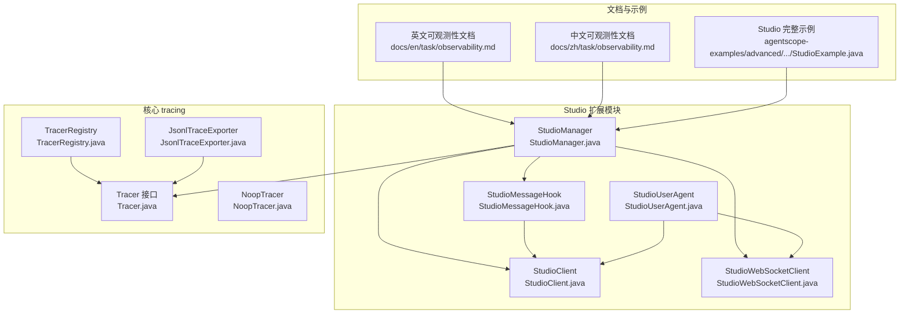
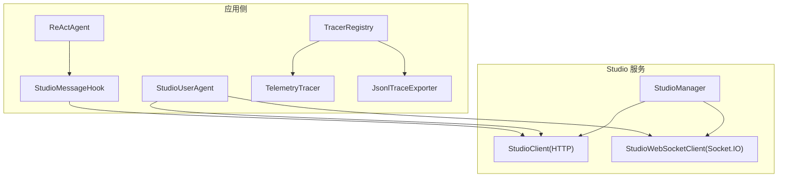
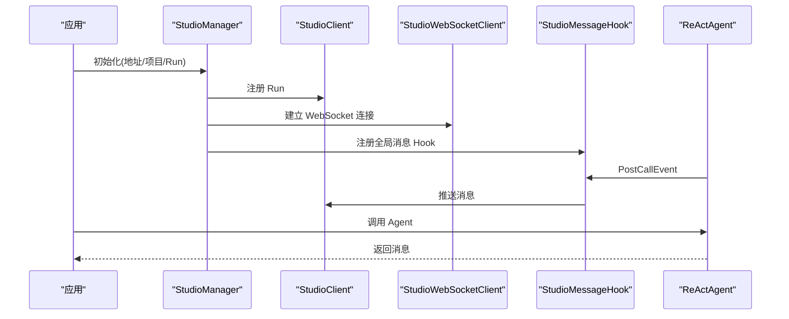
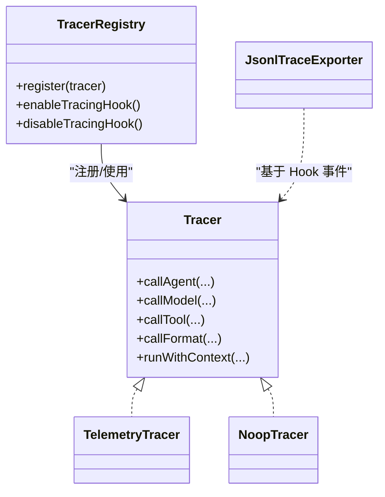
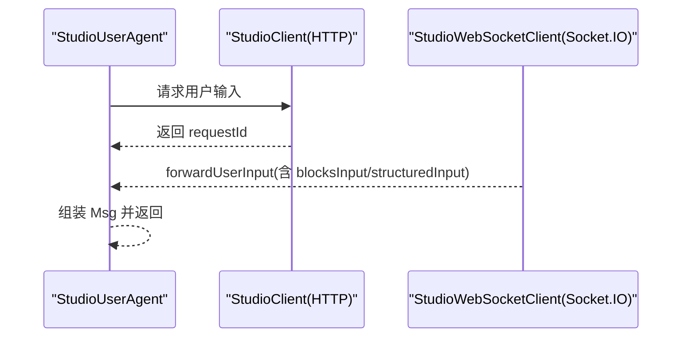
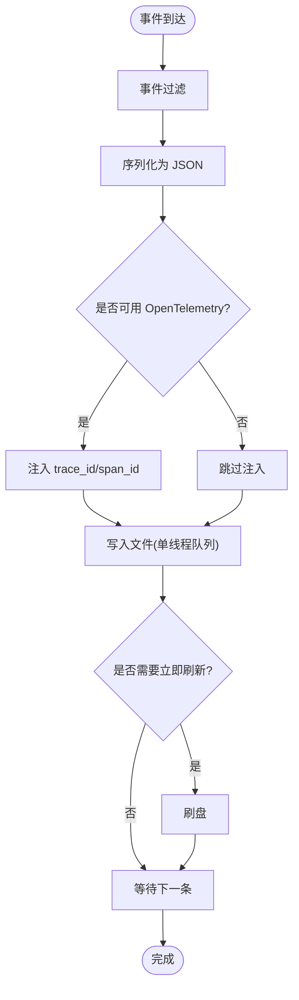
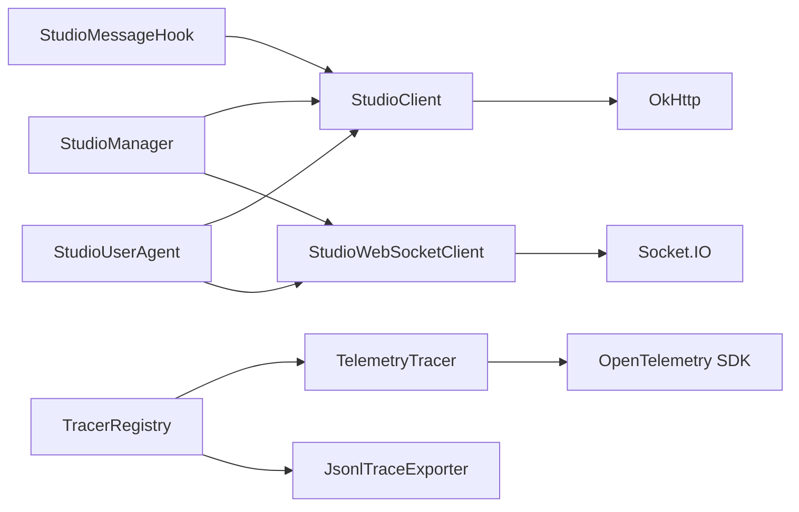

# 可观测性监控系统

<cite>
**本文引用的文件**
- [observability.md](file://docs/en/task/observability.md)
- [observability.md](file://docs/zh/task/observability.md)
- [StudioExample.java](file://agentscope-examples/advanced/src/main/java/io/agentscope/examples/advanced/StudioExample.java)
- [StudioManager.java](file://agentscope-extensions/agentscope-extensions-studio/src/main/java/io/agentscope/core/studio/StudioManager.java)
- [StudioMessageHook.java](file://agentscope-extensions/agentscope-extensions-studio/src/main/java/io/agentscope/core/studio/StudioMessageHook.java)
- [StudioUserAgent.java](file://agentscope-extensions/agentscope-extensions-studio/src/main/java/io/agentscope/core/studio/StudioUserAgent.java)
- [StudioClient.java](file://agentscope-extensions/agentscope-extensions-studio/src/main/java/io/agentscope/core/studio/StudioClient.java)
- [StudioWebSocketClient.java](file://agentscope-extensions/agentscope-extensions-studio/src/main/java/io/agentscope/core/studio/StudioWebSocketClient.java)
- [Tracer.java](file://agentscope-core/src/main/java/io/agentscope/core/tracing/Tracer.java)
- [TracerRegistry.java](file://agentscope-core/src/main/java/io/agentscope/core/tracing/TracerRegistry.java)
- [JsonlTraceExporter.java](file://agentscope-core/src/main/java/io/agentscope/core/hook/recorder/JsonlTraceExporter.java)
- [NoopTracer.java](file://agentscope-core/src/main/java/io/agentscope/core/tracing/NoopTracer.java)
</cite>

## 目录
1. [简介](#简介)
2. [项目结构](#项目结构)
3. [核心组件](#核心组件)
4. [架构总览](#架构总览)
5. [详细组件分析](#详细组件分析)
6. [依赖关系分析](#依赖关系分析)
7. [性能考量](#性能考量)
8. [故障排查指南](#故障排查指南)
9. [结论](#结论)
10. [附录](#附录)

## 简介
本文件面向 AgentScope Java 框架的可观测性监控体系，围绕两大能力展开：
- 原生 OpenTelemetry 集成：提供 Trace、Metrics 与 Logs 的采集与导出能力，支持 OTLP 协议对接 Langfuse、Jaeger 等平台，并内置基于 Hook 的 JSONL 追踪导出器，便于离线诊断。
- AgentScope Studio 可视化调试：通过 HTTP/WebSocket 与 Studio 服务通信，实现实时消息可视化、交互式输入、Trace 展示与多 Run 管理。

文档将从系统架构、组件职责、数据流、处理逻辑、集成步骤、最佳实践与性能优化等方面进行全面阐述，帮助开发者快速搭建完整的监控体系。

## 项目结构
与可观测性相关的核心模块分布如下：
- 文档与示例：英文与中文可观测性文档，包含 Studio 与 OpenTelemetry 的使用说明与示例。
- Studio 扩展模块：提供 StudioManager、StudioClient、StudioWebSocketClient、StudioMessageHook、StudioUserAgent 等，负责与 Studio 的连接、消息推送、用户输入获取与可视化。
- 核心 tracing 接口与注册：Tracer 接口、TracerRegistry 注册中心，以及内置的 JsonlTraceExporter 与 NoopTracer。
- 示例工程：Advanced 示例中的 StudioExample，演示如何初始化 Studio、创建带 Hook 的 Agent 与用户代理，以及对话循环。

图表来源
- [observability.md](file://docs/en/task/observability.md)
- [StudioManager.java](file://agentscope-extensions/agentscope-extensions-studio/src/main/java/io/agentscope/core/studio/StudioManager.java)
- [StudioClient.java](file://agentscope-extensions/agentscope-extensions-studio/src/main/java/io/agentscope/core/studio/StudioClient.java)
- [StudioWebSocketClient.java](file://agentscope-extensions/agentscope-extensions-studio/src/main/java/io/agentscope/core/studio/StudioWebSocketClient.java)
- [StudioMessageHook.java](file://agentscope-extensions/agentscope-extensions-studio/src/main/java/io/agentscope/core/studio/StudioMessageHook.java)
- [StudioUserAgent.java](file://agentscope-extensions/agentscope-extensions-studio/src/main/java/io/agentscope/core/studio/StudioUserAgent.java)
- [Tracer.java](file://agentscope-core/src/main/java/io/agentscope/core/tracing/Tracer.java)
- [TracerRegistry.java](file://agentscope-core/src/main/java/io/agentscope/core/tracing/TracerRegistry.java)
- [JsonlTraceExporter.java](file://agentscope-core/src/main/java/io/agentscope/core/hook/recorder/JsonlTraceExporter.java)
- [NoopTracer.java](file://agentscope-core/src/main/java/io/agentscope/core/tracing/NoopTracer.java)

章节来源
- [observability.md](file://docs/en/task/observability.md)
- [StudioManager.java](file://agentscope-extensions/agentscope-extensions-studio/src/main/java/io/agentscope/core/studio/StudioManager.java)
- [StudioClient.java](file://agentscope-extensions/agentscope-extensions-studio/src/main/java/io/agentscope/core/studio/StudioClient.java)
- [StudioWebSocketClient.java](file://agentscope-extensions/agentscope-extensions-studio/src/main/java/io/agentscope/core/studio/StudioWebSocketClient.java)
- [StudioMessageHook.java](file://agentscope-extensions/agentscope-extensions-studio/src/main/java/io/agentscope/core/studio/StudioMessageHook.java)
- [StudioUserAgent.java](file://agentscope-extensions/agentscope-extensions-studio/src/main/java/io/agentscope/core/studio/StudioUserAgent.java)
- [Tracer.java](file://agentscope-core/src/main/java/io/agentscope/core/tracing/Tracer.java)
- [TracerRegistry.java](file://agentscope-core/src/main/java/io/agentscope/core/tracing/TracerRegistry.java)
- [JsonlTraceExporter.java](file://agentscope-core/src/main/java/io/agentscope/core/hook/recorder/JsonlTraceExporter.java)
- [NoopTracer.java](file://agentscope-core/src/main/java/io/agentscope/core/tracing/NoopTracer.java)

## 核心组件
- StudioManager：集中管理 Studio 集成生命周期，负责初始化 HTTP/WebSocket 客户端、注册 Run、自动注入全局 StudioMessageHook，并按需注册 TelemetryTracer。
- StudioClient：基于 OkHttp 的 HTTP 客户端，提供注册 Run、推送消息、请求用户输入等接口，具备可配置重试策略。
- StudioWebSocketClient：基于 Socket.IO 的 WebSocket 客户端，维护持久连接并监听 forwardUserInput 事件，实现与 Studio 的实时双向通信。
- StudioMessageHook：Hook 实现，拦截 Agent PostCallEvent，异步推送消息至 Studio，失败不中断主流程。
- StudioUserAgent：用户代理，支持终端与 Studio 两种输入模式；在 Studio 模式下通过 HTTP 请求 + WebSocket 接收实现交互。
- Tracer 接口与 TracerRegistry：定义统一的追踪抽象与全局注册入口；支持在 Reactor 管道中传播上下文。
- JsonlTraceExporter：基于 Hook 的 JSONL 追踪导出器，将 Hook 事件序列化为行式 JSON 文件，便于本地离线分析与问题定位。
- NoopTracer：空实现，用于在不需要追踪时避免开销。

章节来源
- [StudioManager.java](file://agentscope-extensions/agentscope-extensions-studio/src/main/java/io/agentscope/core/studio/StudioManager.java)
- [StudioClient.java](file://agentscope-extensions/agentscope-extensions-studio/src/main/java/io/agentscope/core/studio/StudioClient.java)
- [StudioWebSocketClient.java](file://agentscope-extensions/agentscope-extensions-studio/src/main/java/io/agentscope/core/studio/StudioWebSocketClient.java)
- [StudioMessageHook.java](file://agentscope-extensions/agentscope-extensions-studio/src/main/java/io/agentscope/core/studio/StudioMessageHook.java)
- [StudioUserAgent.java](file://agentscope-extensions/agentscope-extensions-studio/src/main/java/io/agentscope/core/studio/StudioUserAgent.java)
- [Tracer.java](file://agentscope-core/src/main/java/io/agentscope/core/tracing/Tracer.java)
- [TracerRegistry.java](file://agentscope-core/src/main/java/io/agentscope/core/tracing/TracerRegistry.java)
- [JsonlTraceExporter.java](file://agentscope-core/src/main/java/io/agentscope/core/hook/recorder/JsonlTraceExporter.java)
- [NoopTracer.java](file://agentscope-core/src/main/java/io/agentscope/core/tracing/NoopTracer.java)

## 架构总览
AgentScope Studio 与 OpenTelemetry 的整体架构如下：

图表来源
- [StudioManager.java](file://agentscope-extensions/agentscope-extensions-studio/src/main/java/io/agentscope/core/studio/StudioManager.java)
- [StudioClient.java](file://agentscope-extensions/agentscope-extensions-studio/src/main/java/io/agentscope/core/studio/StudioClient.java)
- [StudioWebSocketClient.java](file://agentscope-extensions/agentscope-extensions-studio/src/main/java/io/agentscope/core/studio/StudioWebSocketClient.java)
- [StudioMessageHook.java](file://agentscope-extensions/agentscope-extensions-studio/src/main/java/io/agentscope/core/studio/StudioMessageHook.java)
- [StudioUserAgent.java](file://agentscope-extensions/agentscope-extensions-studio/src/main/java/io/agentscope/core/studio/StudioUserAgent.java)
- [TracerRegistry.java](file://agentscope-core/src/main/java/io/agentscope/core/tracing/TracerRegistry.java)

## 详细组件分析

### Studio 集成与可视化调试
- 初始化与生命周期
  - 通过 StudioManager.Builder 设置 Studio 地址、项目名、Run 名称、重试次数与 WebSocket 重连参数，完成初始化后注册 Run 并建立 WebSocket 连接。
  - 自动注入全局 StudioMessageHook，使所有 Agent 的 PostCallEvent 输出自动推送到 Studio。
- 消息推送
  - StudioMessageHook 在事件发生后异步推送消息，失败仅记录日志，不影响 Agent 主流程。
- 用户输入
  - StudioUserAgent 支持两种输入方式：终端与 Studio。在 Studio 模式下，先通过 HTTP 请求触发 UI 表单，再通过 WebSocket 接收用户输入。
- 示例
  - Advanced 示例展示了完整的初始化、Agent 创建、用户代理与对话循环。

图表来源
- [StudioManager.java](file://agentscope-extensions/agentscope-extensions-studio/src/main/java/io/agentscope/core/studio/StudioManager.java)
- [StudioClient.java](file://agentscope-extensions/agentscope-extensions-studio/src/main/java/io/agentscope/core/studio/StudioClient.java)
- [StudioWebSocketClient.java](file://agentscope-extensions/agentscope-extensions-studio/src/main/java/io/agentscope/core/studio/StudioWebSocketClient.java)
- [StudioMessageHook.java](file://agentscope-extensions/agentscope-extensions-studio/src/main/java/io/agentscope/core/studio/StudioMessageHook.java)
- [StudioExample.java](file://agentscope-examples/advanced/src/main/java/io/agentscope/examples/advanced/StudioExample.java)

章节来源
- [StudioManager.java](file://agentscope-extensions/agentscope-extensions-studio/src/main/java/io/agentscope/core/studio/StudioManager.java)
- [StudioClient.java](file://agentscope-extensions/agentscope-extensions-studio/src/main/java/io/agentscope/core/studio/StudioClient.java)
- [StudioWebSocketClient.java](file://agentscope-extensions/agentscope-extensions-studio/src/main/java/io/agentscope/core/studio/StudioWebSocketClient.java)
- [StudioMessageHook.java](file://agentscope-extensions/agentscope-extensions-studio/src/main/java/io/agentscope/core/studio/StudioMessageHook.java)
- [StudioUserAgent.java](file://agentscope-extensions/agentscope-extensions-studio/src/main/java/io/agentscope/core/studio/StudioUserAgent.java)
- [StudioExample.java](file://agentscope-examples/advanced/src/main/java/io/agentscope/examples/advanced/StudioExample.java)

### OpenTelemetry 分布式追踪
- 全局注册与自动追踪
  - 通过 TracerRegistry.register 注册 TelemetryTracer，即可对 Agent 调用、模型调用、工具执行、消息格式化等操作自动产生 Span。
  - TracerRegistry 提供 Reactor 上下文传播钩子开关，可在需要时启用跨管道的追踪上下文传播。
- 导出与平台对接
  - 支持 OTLP 协议，可对接 Langfuse、Jaeger 等平台；文档提供了针对 Langfuse 的认证头配置与 Jaeger 的端点示例。
- 内置 JSONL 导出器
  - JsonlTraceExporter 基于 Hook 事件系统，将事件写入行式 JSON 文件，适合本地调试与离线问题定位；默认尽力而为，可通过配置选择失败即停策略。

图表来源
- [Tracer.java](file://agentscope-core/src/main/java/io/agentscope/core/tracing/Tracer.java)
- [TracerRegistry.java](file://agentscope-core/src/main/java/io/agentscope/core/tracing/TracerRegistry.java)
- [JsonlTraceExporter.java](file://agentscope-core/src/main/java/io/agentscope/core/hook/recorder/JsonlTraceExporter.java)
- [NoopTracer.java](file://agentscope-core/src/main/java/io/agentscope/core/tracing/NoopTracer.java)

章节来源
- [Tracer.java](file://agentscope-core/src/main/java/io/agentscope/core/tracing/Tracer.java)
- [TracerRegistry.java](file://agentscope-core/src/main/java/io/agentscope/core/tracing/TracerRegistry.java)
- [JsonlTraceExporter.java](file://agentscope-core/src/main/java/io/agentscope/core/hook/recorder/JsonlTraceExporter.java)
- [NoopTracer.java](file://agentscope-core/src/main/java/io/agentscope/core/tracing/NoopTracer.java)
- [observability.md](file://docs/en/task/observability.md)
- [observability.md](file://docs/zh/task/observability.md)

### 用户输入与消息流（Studio 模式）
- 流程概览
  - 应用通过 StudioClient.requestUserInput 触发 Studio UI 表单；
  - Studio 通过 WebSocket 向应用推送 forwardUserInput；
  - StudioWebSocketClient.waitForInput 将输入解析为 Msg 并返回给调用方。
- 错误与降级
  - 若 WebSocket 获取失败，回退到终端输入；网络异常与超时有明确日志提示。

图表来源
- [StudioUserAgent.java](file://agentscope-extensions/agentscope-extensions-studio/src/main/java/io/agentscope/core/studio/StudioUserAgent.java)
- [StudioClient.java](file://agentscope-extensions/agentscope-extensions-studio/src/main/java/io/agentscope/core/studio/StudioClient.java)
- [StudioWebSocketClient.java](file://agentscope-extensions/agentscope-extensions-studio/src/main/java/io/agentscope/core/studio/StudioWebSocketClient.java)

章节来源
- [StudioUserAgent.java](file://agentscope-extensions/agentscope-extensions-studio/src/main/java/io/agentscope/core/studio/StudioUserAgent.java)
- [StudioClient.java](file://agentscope-extensions/agentscope-extensions-studio/src/main/java/io/agentscope/core/studio/StudioClient.java)
- [StudioWebSocketClient.java](file://agentscope-extensions/agentscope-extensions-studio/src/main/java/io/agentscope/core/studio/StudioWebSocketClient.java)

### JSONL 追踪导出器（离线诊断）
- 设计要点
  - 基于 Hook 事件系统，逐条事件写入 JSONL 文件；
  - 单线程队列保证顺序一致性，支持阻塞式 IO；
  - 可配置 flush 策略、失败行为、事件过滤与优先级；
  - 当运行环境存在 OpenTelemetry 时，自动注入 trace_id/span_id 字段。
- 使用场景
  - 本地调试、离线问题复现、问题上报附件。

图表来源
- [JsonlTraceExporter.java](file://agentscope-core/src/main/java/io/agentscope/core/hook/recorder/JsonlTraceExporter.java)

章节来源
- [JsonlTraceExporter.java](file://agentscope-core/src/main/java/io/agentscope/core/hook/recorder/JsonlTraceExporter.java)

## 依赖关系分析
- 组件耦合
  - StudioManager 作为门面，协调 StudioClient 与 StudioWebSocketClient，并在初始化时注入全局 Hook 与 TelemetryTracer。
  - StudioMessageHook 仅依赖 StudioClient，保持低耦合；对失败采用 fire-and-forget 式处理，避免阻塞主流程。
  - TracerRegistry 与 Tracer 抽象解耦具体实现，支持 TelemetryTracer 与 NoopTracer 切换。
- 外部依赖
  - Studio 服务端（HTTP REST 与 Socket.IO）；
  - OpenTelemetry SDK（当使用 TelemetryTracer 时）；
  - OkHttp 与 Socket.IO 客户端库（HTTP 与 WebSocket）。

图表来源
- [StudioManager.java](file://agentscope-extensions/agentscope-extensions-studio/src/main/java/io/agentscope/core/studio/StudioManager.java)
- [StudioClient.java](file://agentscope-extensions/agentscope-extensions-studio/src/main/java/io/agentscope/core/studio/StudioClient.java)
- [StudioWebSocketClient.java](file://agentscope-extensions/agentscope-extensions-studio/src/main/java/io/agentscope/core/studio/StudioWebSocketClient.java)
- [StudioMessageHook.java](file://agentscope-extensions/agentscope-extensions-studio/src/main/java/io/agentscope/core/studio/StudioMessageHook.java)
- [StudioUserAgent.java](file://agentscope-extensions/agentscope-extensions-studio/src/main/java/io/agentscope/core/studio/StudioUserAgent.java)
- [TracerRegistry.java](file://agentscope-core/src/main/java/io/agentscope/core/tracing/TracerRegistry.java)

章节来源
- [StudioManager.java](file://agentscope-extensions/agentscope-extensions-studio/src/main/java/io/agentscope/core/studio/StudioManager.java)
- [StudioClient.java](file://agentscope-extensions/agentscope-extensions-studio/src/main/java/io/agentscope/core/studio/StudioClient.java)
- [StudioWebSocketClient.java](file://agentscope-extensions/agentscope-extensions-studio/src/main/java/io/agentscope/core/studio/StudioWebSocketClient.java)
- [StudioMessageHook.java](file://agentscope-extensions/agentscope-extensions-studio/src/main/java/io/agentscope/core/studio/StudioMessageHook.java)
- [StudioUserAgent.java](file://agentscope-extensions/agentscope-extensions-studio/src/main/java/io/agentscope/core/studio/StudioUserAgent.java)
- [TracerRegistry.java](file://agentscope-core/src/main/java/io/agentscope/core/tracing/TracerRegistry.java)

## 性能考量
- 追踪开销
  - TelemetryTracer 为全局自动追踪，建议在生产环境谨慎开启，必要时通过 TracerRegistry 的钩子控制范围。
  - JsonlTraceExporter 采用单线程队列与阻塞 IO，适合离线分析，不适合高吞吐线上路径。
- 网络可靠性
  - StudioClient 与 StudioWebSocketClient 均提供重试与自动重连机制，但应结合业务超时策略与降级方案。
- Reactor 上下文传播
  - TracerRegistry 提供全局 Reactor 钩子，启用后会影响整个 JVM 的 Reactor 管道，需评估性能影响。

## 故障排查指南
- Studio 连接失败
  - 检查 StudioManager 初始化参数（URL、项目、Run 名称），确认 HTTP 与 WebSocket 端点可达。
  - 关注 StudioClient 的重试日志与 StudioWebSocketClient 的连接状态事件。
- 消息未显示
  - 确认已注入 StudioMessageHook，且 Agent 的 PostCallEvent 已触发。
  - 检查 StudioClient.pushMessage 的响应状态与日志。
- 用户输入无响应
  - 确认 StudioUserAgent 已正确设置 StudioClient 与 WebSocketClient。
  - 检查 StudioWebSocketClient.waitForInput 的超时与 requestId 匹配情况。
- 追踪缺失或错误
  - 确认 TracerRegistry 已注册 TelemetryTracer，且端点与认证头配置正确。
  - 使用 JsonlTraceExporter 辅助定位事件丢失或序列化异常。

章节来源
- [StudioManager.java](file://agentscope-extensions/agentscope-extensions-studio/src/main/java/io/agentscope/core/studio/StudioManager.java)
- [StudioClient.java](file://agentscope-extensions/agentscope-extensions-studio/src/main/java/io/agentscope/core/studio/StudioClient.java)
- [StudioWebSocketClient.java](file://agentscope-extensions/agentscope-extensions-studio/src/main/java/io/agentscope/core/studio/StudioWebSocketClient.java)
- [StudioMessageHook.java](file://agentscope-extensions/agentscope-extensions-studio/src/main/java/io/agentscope/core/studio/StudioMessageHook.java)
- [StudioUserAgent.java](file://agentscope-extensions/agentscope-extensions-studio/src/main/java/io/agentscope/core/studio/StudioUserAgent.java)
- [TracerRegistry.java](file://agentscope-core/src/main/java/io/agentscope/core/tracing/TracerRegistry.java)
- [JsonlTraceExporter.java](file://agentscope-core/src/main/java/io/agentscope/core/hook/recorder/JsonlTraceExporter.java)

## 结论
AgentScope Java 的可观测性体系以 Studio 与 OpenTelemetry 为核心，既满足实时可视化与交互调试的需求，又提供可扩展的分布式追踪能力。通过 StudioManager 的集中管理与 TracerRegistry 的全局注册，开发者可以快速构建从本地调试到云端观测的完整闭环。建议在开发阶段充分利用 Studio 的可视化与 JsonlTraceExporter 的离线能力，在生产阶段结合 TelemetryTracer 与合适的 OTLP 后端实现端到端的可观测性。

## 附录

### 快速开始清单
- Studio
  - 启动 Studio 服务端（参考文档中的安装与运行说明）。
  - 在应用中初始化 StudioManager，设置 studioUrl、project、runName，并调用 initialize。
  - 为 Agent 添加 StudioMessageHook，或使用 StudioUserAgent 获取用户输入。
- OpenTelemetry
  - 在 TracerRegistry 中注册 TelemetryTracer，配置 endpoint 与必要的认证头。
  - 如需本地离线分析，可启用 JsonlTraceExporter。

章节来源
- [observability.md](file://docs/en/task/observability.md)
- [observability.md](file://docs/zh/task/observability.md)
- [StudioManager.java](file://agentscope-extensions/agentscope-extensions-studio/src/main/java/io/agentscope/core/studio/StudioManager.java)
- [TracerRegistry.java](file://agentscope-core/src/main/java/io/agentscope/core/tracing/TracerRegistry.java)
- [JsonlTraceExporter.java](file://agentscope-core/src/main/java/io/agentscope/core/hook/recorder/JsonlTraceExporter.java)