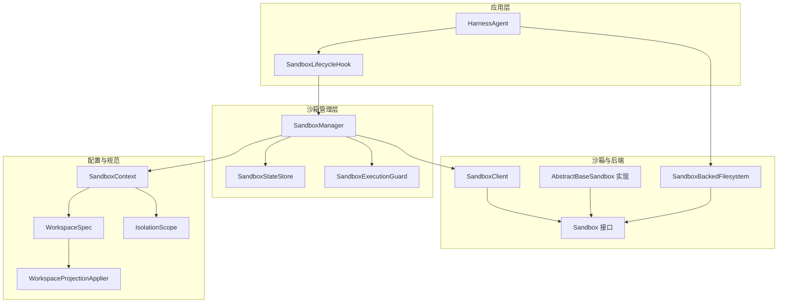
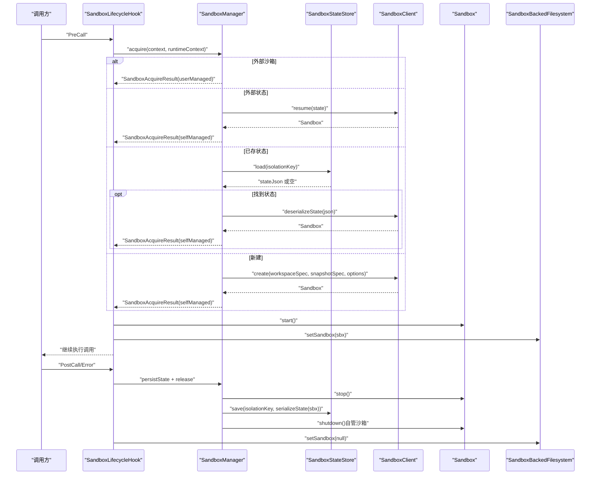
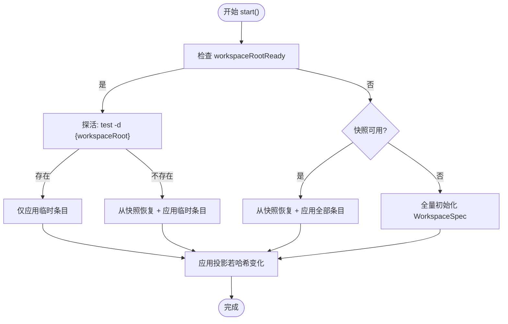
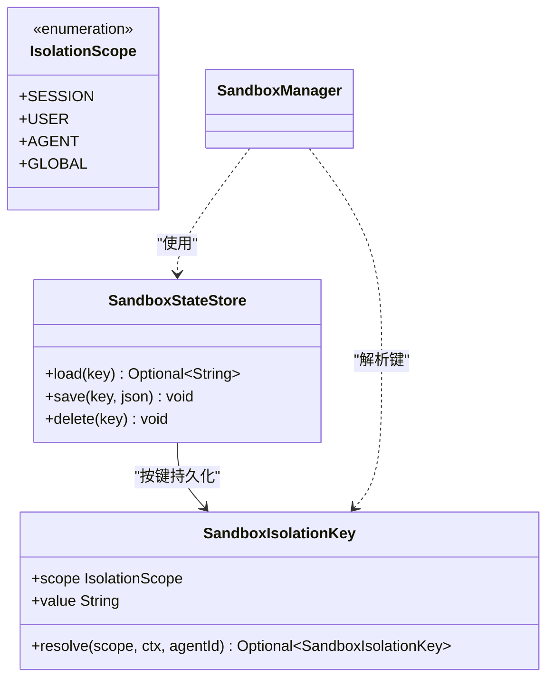
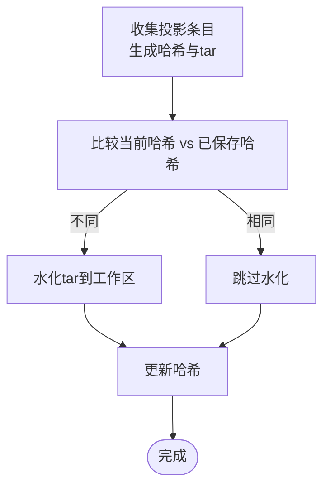
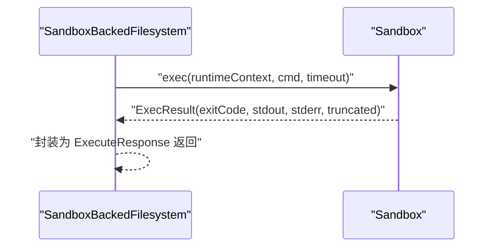
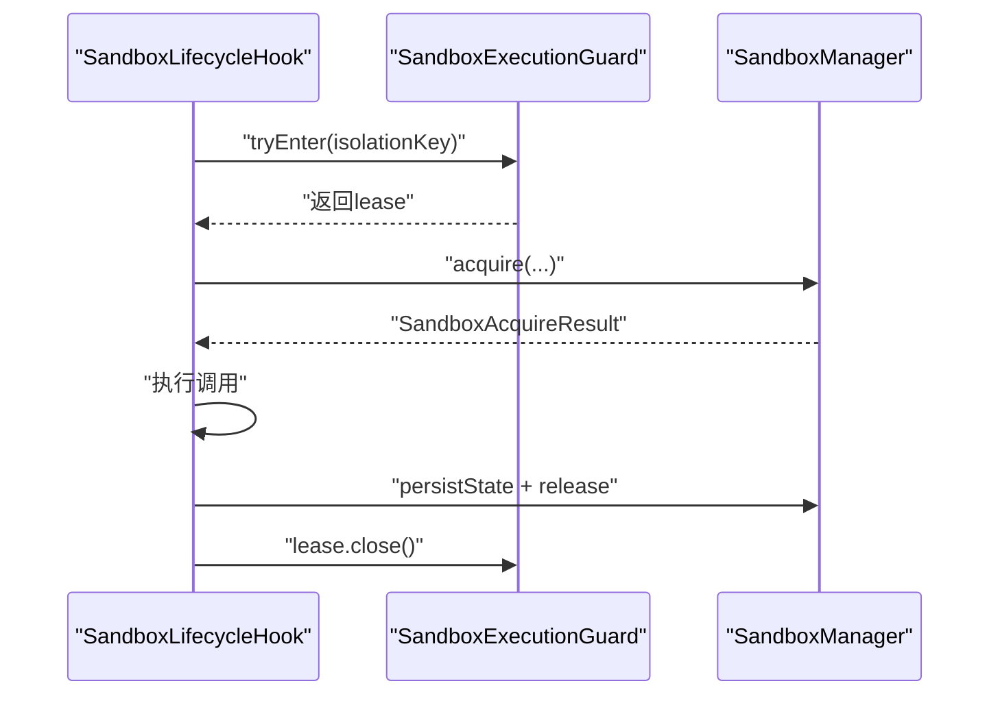
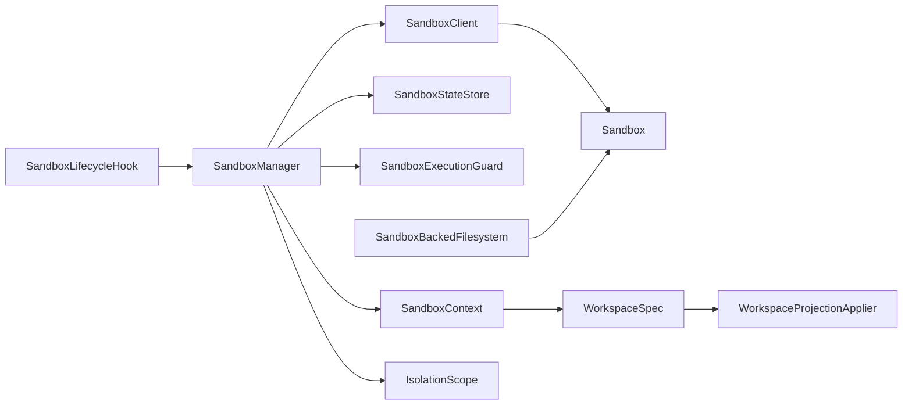

# 安全沙箱执行环境

<cite>
**本文引用的文件**   
- [Sandbox.java](file://agentscope-harness/src/main/java/io/agentscope/harness/agent/sandbox/Sandbox.java)
- [AbstractBaseSandbox.java](file://agentscope-harness/src/main/java/io/agentscope/harness/agent/sandbox/AbstractBaseSandbox.java)
- [SandboxManager.java](file://agentscope-harness/src/main/java/io/agentscope/harness/agent/sandbox/SandboxManager.java)
- [SandboxContext.java](file://agentscope-harness/src/main/java/io/agentscope/harness/agent/sandbox/SandboxContext.java)
- [WorkspaceSpec.java](file://agentscope-harness/src/main/java/io/agentscope/harness/agent/sandbox/WorkspaceSpec.java)
- [WorkspaceProjectionApplier.java](file://agentscope-harness/src/main/java/io/agentscope/harness/agent/sandbox/WorkspaceProjectionApplier.java)
- [IsolationScope.java](file://agentscope-harness/src/main/java/io/agentscope/harness/agent/IsolationScope.java)
- [SandboxStateStore.java](file://agentscope-harness/src/main/java/io/agentscope/harness/agent/sandbox/SandboxStateStore.java)
- [SandboxBackedFilesystem.java](file://agentscope-harness/src/main/java/io/agentscope/harness/agent/filesystem/sandbox/SandboxBackedFilesystem.java)
- [SandboxLifecycleHook.java](file://agentscope-harness/src/main/java/io/agentscope/harness/agent/hook/SandboxLifecycleHook.java)
- [index.md（沙箱文档）](file://docs/en/harness/sandbox/index.md)
- [filesystem.md（文件系统文档）](file://docs/en/harness/filesystem.md)
- [WorkspaceSandboxStateStoreTest.java](file://agentscope-harness/src/test/java/io/agentscope/harness/agent/sandbox/WorkspaceSandboxStateStoreTest.java)
- [SandboxManagerIsolationTest.java](file://agentscope-harness/src/test/java/io/agentscope/harness/agent/sandbox/SandboxManagerIsolationTest.java)
- [InMemorySandbox.java](file://agentscope-harness/src/test/java/io/agentscope/harness/agent/example/support/InMemorySandbox.java)
- [InMemorySandboxClient.java](file://agentscope-harness/src/test/java/io/agentscope/harness/agent/example/support/InMemorySandboxClient.java)
- [InMemorySandboxFilesystemSpec.java](file://agentscope-harness/src/test/java/io/agentscope/harness/agent/example/support/InMemorySandboxFilesystemSpec.java)
</cite>

## 目录
1. [简介](#简介)
2. [项目结构](#项目结构)
3. [核心组件](#核心组件)
4. [架构总览](#架构总览)
5. [详细组件分析](#详细组件分析)
6. [依赖关系分析](#依赖关系分析)
7. [性能考量](#性能考量)
8. [故障排除指南](#故障排除指南)
9. [结论](#结论)
10. [附录](#附录)

## 简介
本文件面向 AgentScope Java 框架的安全沙箱执行环境，系统性阐述沙箱隔离机制的设计原理与实现细节，覆盖进程隔离、网络隔离、文件系统隔离与资源限制；解释 Workspace 投影机制、快照管理与状态持久化策略；给出沙箱配置选项、安全策略与访问控制清单；并提供安全威胁模型、防护措施与审计日志建议，以及完整配置示例与故障排除指南，帮助开发者在生产环境中正确部署与管理沙箱。

## 项目结构
AgentScope 的沙箱能力由 harness 子模块提供，核心围绕以下层次组织：
- 接口与抽象：Sandbox、AbstractBaseSandbox 定义生命周期与通用行为
- 管理与协调：SandboxManager 负责获取/释放沙箱、状态持久化与并发保护
- 配置与上下文：SandboxContext、WorkspaceSpec、IsolationScope 提供可插拔的隔离维度与工作区定义
- 文件系统桥接：SandboxBackedFilesystem 将上层文件操作路由到沙箱内部
- 生命周期钩子：SandboxLifecycleHook 在每次调用前后自动启动/停止/持久化
- 文档与示例：官方文档与测试示例展示投影、快照与隔离策略

图示来源
- [Sandbox.java:42-77](file://agentscope-harness/src/main/java/io/agentscope/harness/agent/sandbox/Sandbox.java#L42-L77)
- [AbstractBaseSandbox.java:48-288](file://agentscope-harness/src/main/java/io/agentscope/harness/agent/sandbox/AbstractBaseSandbox.java#L48-L288)
- [SandboxManager.java:40-215](file://agentscope-harness/src/main/java/io/agentscope/harness/agent/sandbox/SandboxManager.java#L40-L215)
- [SandboxContext.java:27-130](file://agentscope-harness/src/main/java/io/agentscope/harness/agent/sandbox/SandboxContext.java#L27-L130)
- [WorkspaceSpec.java:43-86](file://agentscope-harness/src/main/java/io/agentscope/harness/agent/sandbox/WorkspaceSpec.java#L43-L86)
- [WorkspaceProjectionApplier.java:43-156](file://agentscope-harness/src/main/java/io/agentscope/harness/agent/sandbox/WorkspaceProjectionApplier.java#L43-L156)
- [IsolationScope.java:50-86](file://agentscope-harness/src/main/java/io/agentscope/harness/agent/IsolationScope.java#L50-L86)
- [SandboxBackedFilesystem.java:48-186](file://agentscope-harness/src/main/java/io/agentscope/harness/agent/filesystem/sandbox/SandboxBackedFilesystem.java#L48-L186)
- [SandboxLifecycleHook.java:113-160](file://agentscope-harness/src/main/java/io/agentscope/harness/agent/hook/SandboxLifecycleHook.java#L113-L160)

章节来源
- [index.md（沙箱文档）:1-491](file://docs/en/harness/sandbox/index.md#L1-L491)
- [filesystem.md（文件系统文档）:76-98](file://docs/en/harness/filesystem.md#L76-L98)

## 核心组件
- Sandbox 接口：定义沙箱生命周期（start/stop/shutdown/close）、命令执行、工作区归档/水化与状态查询
- AbstractBaseSandbox：实现 4 分支恢复逻辑（A/B/C/D），统一处理探活、归档、水化与投影应用
- SandboxManager：按优先级获取沙箱（外部实例/外部状态/已存状态/新建），负责 stop 与 shutdown，并在调用结束时持久化状态
- SandboxContext：封装客户端、工作区规格、快照规格、隔离范围等配置
- WorkspaceSpec：描述工作区根目录、条目与环境变量，支持投影与挂载
- WorkspaceProjectionApplier：构建投影归档与哈希，避免重复同步
- IsolationScope：定义 SESSION/USER/AGENT/GLOBAL 四种隔离维度
- SandboxStateStore：以隔离键为单位持久化/加载沙箱元数据（会话 ID、快照引用）
- SandboxBackedFilesystem：将文件系统操作转发至当前激活的沙箱
- SandboxLifecycleHook：在每次调用前 acquire/start，在后端 persistState/release

章节来源
- [Sandbox.java:42-77](file://agentscope-harness/src/main/java/io/agentscope/harness/agent/sandbox/Sandbox.java#L42-L77)
- [AbstractBaseSandbox.java:69-141](file://agentscope-harness/src/main/java/io/agentscope/harness/agent/sandbox/AbstractBaseSandbox.java#L69-L141)
- [SandboxManager.java:65-139](file://agentscope-harness/src/main/java/io/agentscope/harness/agent/sandbox/SandboxManager.java#L65-L139)
- [SandboxContext.java:27-73](file://agentscope-harness/src/main/java/io/agentscope/harness/agent/sandbox/SandboxContext.java#L27-L73)
- [WorkspaceSpec.java:43-86](file://agentscope-harness/src/main/java/io/agentscope/harness/agent/sandbox/WorkspaceSpec.java#L43-L86)
- [WorkspaceProjectionApplier.java:50-88](file://agentscope-harness/src/main/java/io/agentscope/harness/agent/sandbox/WorkspaceProjectionApplier.java#L50-L88)
- [IsolationScope.java:50-86](file://agentscope-harness/src/main/java/io/agentscope/harness/agent/IsolationScope.java#L50-L86)
- [SandboxStateStore.java:30-61](file://agentscope-harness/src/main/java/io/agentscope/harness/agent/sandbox/SandboxStateStore.java#L30-L61)
- [SandboxBackedFilesystem.java:58-94](file://agentscope-harness/src/main/java/io/agentscope/harness/agent/filesystem/sandbox/SandboxBackedFilesystem.java#L58-L94)
- [SandboxLifecycleHook.java:113-160](file://agentscope-harness/src/main/java/io/agentscope/harness/agent/hook/SandboxLifecycleHook.java#L113-L160)

## 架构总览
下图展示从调用入口到沙箱执行与状态持久化的整体流程，以及隔离键与状态存储的关系。

图示来源
- [SandboxManager.java:65-139](file://agentscope-harness/src/main/java/io/agentscope/harness/agent/sandbox/SandboxManager.java#L65-L139)
- [SandboxLifecycleHook.java:113-160](file://agentscope-harness/src/main/java/io/agentscope/harness/agent/hook/SandboxLifecycleHook.java#L113-L160)
- [SandboxBackedFilesystem.java:58-66](file://agentscope-harness/src/main/java/io/agentscope/harness/agent/filesystem/sandbox/SandboxBackedFilesystem.java#L58-L66)
- [SandboxStateStore.java:39-60](file://agentscope-harness/src/main/java/io/agentscope/harness/agent/sandbox/SandboxStateStore.java#L39-L60)

## 详细组件分析

### 沙箱生命周期与 4 分支恢复
- 4 分支逻辑确保在容器可用性与快照可用性不同组合下的正确恢复：
  - A：工作区根存在 → 仅应用临时条目（快速热启动）
  - B：工作区根不存在 → 从快照恢复 + 应用临时条目
  - C：工作区未就绪且快照可用 → 从快照恢复 + 应用全部条目
  - D：工作区未就绪且无快照 → 全量初始化 WorkspaceSpec
- 投影应用：在 start 结尾根据投影哈希决定是否重新水化，避免重复传输
- 命令执行默认超时与探活：通过 probeWorkspaceRootForPreservedResume 与默认超时保障稳健性

图示来源
- [AbstractBaseSandbox.java:70-124](file://agentscope-harness/src/main/java/io/agentscope/harness/agent/sandbox/AbstractBaseSandbox.java#L70-L124)
- [AbstractBaseSandbox.java:267-287](file://agentscope-harness/src/main/java/io/agentscope/harness/agent/sandbox/AbstractBaseSandbox.java#L267-L287)

章节来源
- [AbstractBaseSandbox.java:69-141](file://agentscope-harness/src/main/java/io/agentscope/harness/agent/sandbox/AbstractBaseSandbox.java#L69-L141)
- [index.md（沙箱文档）:261-270](file://docs/en/harness/sandbox/index.md#L261-L270)

### 隔离维度与状态持久化
- IsolationScope 决定状态查找键与命名空间前缀：
  - SESSION：按会话隔离，默认行为
  - USER：按用户共享（分布式场景推荐）
  - AGENT：按代理名共享
  - GLOBAL：全局共享
- 状态存储：
  - SandboxStateStore 抽象了按隔离键的持久化/加载/删除
  - 默认实现基于 Session 的 WorkspaceSession，也可替换为 Redis/OSS 等分布式存储
- 测试验证：
  - WorkspaceSandboxStateStoreTest 展示了 SESSION/USER/GLOBAL 不同作用域的路径布局与读写删除行为
  - SandboxManagerIsolationTest 验证了缺失隔离键时跳过持久化的行为

图示来源
- [SandboxStateStore.java:30-61](file://agentscope-harness/src/main/java/io/agentscope/harness/agent/sandbox/SandboxStateStore.java#L30-L61)
- [IsolationScope.java:50-86](file://agentscope-harness/src/main/java/io/agentscope/harness/agent/IsolationScope.java#L50-L86)
- [WorkspaceSandboxStateStoreTest.java:47-70](file://agentscope-harness/src/test/java/io/agentscope/harness/agent/sandbox/WorkspaceSandboxStateStoreTest.java#L47-L70)
- [SandboxManagerIsolationTest.java:230-247](file://agentscope-harness/src/test/java/io/agentscope/harness/agent/sandbox/SandboxManagerIsolationTest.java#L230-L247)

章节来源
- [IsolationScope.java:50-86](file://agentscope-harness/src/main/java/io/agentscope/harness/agent/IsolationScope.java#L50-L86)
- [SandboxStateStore.java:30-61](file://agentscope-harness/src/main/java/io/agentscope/harness/agent/sandbox/SandboxStateStore.java#L30-L61)
- [WorkspaceSandboxStateStoreTest.java:47-70](file://agentscope-harness/src/test/java/io/agentscope/harness/agent/sandbox/WorkspaceSandboxStateStoreTest.java#L47-L70)
- [SandboxManagerIsolationTest.java:230-247](file://agentscope-harness/src/test/java/io/agentscope/harness/agent/sandbox/SandboxManagerIsolationTest.java#L230-L247)

### Workspace 投影与快照
- 投影机制：
  - WorkspaceProjectionApplier 收集投影条目，生成确定性哈希与 tar 包，仅在哈希变化时进行水化
  - 支持目录递归收集与路径规范化，避免越界与重复
- 快照与恢复：
  - stop() 可选持久化工作区归档；start() 依据 4 分支逻辑选择恢复路径
  - 投影与快照共同保证“状态可恢复、技能可复用、依赖可复用”

图示来源
- [WorkspaceProjectionApplier.java:50-88](file://agentscope-harness/src/main/java/io/agentscope/harness/agent/sandbox/WorkspaceProjectionApplier.java#L50-L88)
- [AbstractBaseSandbox.java:267-287](file://agentscope-harness/src/main/java/io/agentscope/harness/agent/sandbox/AbstractBaseSandbox.java#L267-L287)

章节来源
- [WorkspaceProjectionApplier.java:43-156](file://agentscope-harness/src/main/java/io/agentscope/harness/agent/sandbox/WorkspaceProjectionApplier.java#L43-L156)
- [index.md（沙箱文档）:285-345](file://docs/en/harness/sandbox/index.md#L285-L345)

### 文件系统桥接与命令执行
- SandboxBackedFilesystem 将文件系统操作（上传/下载/执行）转发给当前激活的 Sandbox
- execute/cmd 通过 Sandbox.exec 执行，返回退出码、输出与截断标记
- 未激活沙箱时抛出配置异常，确保调用边界清晰

图示来源
- [SandboxBackedFilesystem.java:73-94](file://agentscope-harness/src/main/java/io/agentscope/harness/agent/filesystem/sandbox/SandboxBackedFilesystem.java#L73-L94)
- [Sandbox.java:71-76](file://agentscope-harness/src/main/java/io/agentscope/harness/agent/sandbox/Sandbox.java#L71-L76)

章节来源
- [SandboxBackedFilesystem.java:58-94](file://agentscope-harness/src/main/java/io/agentscope/harness/agent/filesystem/sandbox/SandboxBackedFilesystem.java#L58-L94)
- [SandboxBackedFilesystem.java:96-138](file://agentscope-harness/src/main/java/io/agentscope/harness/agent/filesystem/sandbox/SandboxBackedFilesystem.java#L96-L138)
- [SandboxBackedFilesystem.java:140-177](file://agentscope-harness/src/main/java/io/agentscope/harness/agent/filesystem/sandbox/SandboxBackedFilesystem.java#L140-L177)
- [SandboxBackedFilesystem.java:179-186](file://agentscope-harness/src/main/java/io/agentscope/harness/agent/filesystem/sandbox/SandboxBackedFilesystem.java#L179-L186)

### 并发控制与分布式一致性
- SandboxExecutionGuard 提供分布式互斥，确保 USER/AGENT/GLOBAL 场景下共享槽位的串行化
- 默认实现基于 Redis SET NX PX 租约，键格式包含隔离维度与值，便于多环境隔离
- 生命周期内 tryEnter 在 acquire 前阻塞，lease.close() 在 release 后释放

图示来源
- [SandboxManager.java:85-94](file://agentscope-harness/src/main/java/io/agentscope/harness/agent/sandbox/SandboxManager.java#L85-L94)
- [SandboxManager.java:141-163](file://agentscope-harness/src/main/java/io/agentscope/harness/agent/sandbox/SandboxManager.java#L141-L163)
- [index.md（沙箱文档）:353-434](file://docs/en/harness/sandbox/index.md#L353-L434)

章节来源
- [index.md（沙箱文档）:353-434](file://docs/en/harness/sandbox/index.md#L353-L434)

### 配置与扩展点
- SandboxContext：注入客户端、工作区规格、快照规格、隔离范围与外部沙箱/状态
- WorkspaceSpec：定义工作区根、条目（含投影/挂载）与环境变量
- SandboxFilesystemSpec：将上述配置接入 HarnessAgent，支持自定义后端（如 Docker/Kubernetes/Daytona/E2B）
- 自检清单：状态 JSON 可逆序列化、类型标识一致、Jackson 注册、文件系统路由正确

章节来源
- [SandboxContext.java:27-130](file://agentscope-harness/src/main/java/io/agentscope/harness/agent/sandbox/SandboxContext.java#L27-L130)
- [WorkspaceSpec.java:43-86](file://agentscope-harness/src/main/java/io/agentscope/harness/agent/sandbox/WorkspaceSpec.java#L43-L86)
- [index.md（沙箱文档）:178-232](file://docs/en/harness/sandbox/index.md#L178-L232)

## 依赖关系分析
- 组件耦合与内聚：
  - SandboxManager 对外仅依赖 SandboxClient/SandboxStateStore/SandboxExecutionGuard，内聚于沙箱生命周期编排
  - Sandbox 与 AbstractBaseSandbox 解耦具体后端，通过抽象方法连接真实执行环境
  - SandboxBackedFilesystem 仅依赖当前激活的 Sandbox，降低与上层业务的耦合
- 直接/间接依赖：
  - SandboxLifecycleHook 依赖 SandboxManager 与 SandboxBackedFilesystem
  - WorkspaceProjectionApplier 依赖 WorkspaceSpec 条目与 tar 库
  - IsolationScope 作为跨模块的共享枚举，贯穿状态存储与远程文件系统命名空间
- 外部集成点：
  - Docker/Kubernetes/Daytona/E2B 等后端通过 SandboxClient 插件化接入
  - Redis/本地文件/OSS 等快照与状态存储通过 SnapshotSpec/StateStore 插件化接入

图示来源
- [SandboxManager.java:40-63](file://agentscope-harness/src/main/java/io/agentscope/harness/agent/sandbox/SandboxManager.java#L40-L63)
- [SandboxBackedFilesystem.java:48-66](file://agentscope-harness/src/main/java/io/agentscope/harness/agent/filesystem/sandbox/SandboxBackedFilesystem.java#L48-L66)
- [WorkspaceSpec.java:43-86](file://agentscope-harness/src/main/java/io/agentscope/harness/agent/sandbox/WorkspaceSpec.java#L43-L86)
- [WorkspaceProjectionApplier.java:43-88](file://agentscope-harness/src/main/java/io/agentscope/harness/agent/sandbox/WorkspaceProjectionApplier.java#L43-L88)
- [IsolationScope.java:50-86](file://agentscope-harness/src/main/java/io/agentscope/harness/agent/IsolationScope.java#L50-L86)

章节来源
- [SandboxManager.java:40-63](file://agentscope-harness/src/main/java/io/agentscope/harness/agent/sandbox/SandboxManager.java#L40-L63)
- [SandboxBackedFilesystem.java:48-66](file://agentscope-harness/src/main/java/io/agentscope/harness/agent/filesystem/sandbox/SandboxBackedFilesystem.java#L48-L66)
- [WorkspaceSpec.java:43-86](file://agentscope-harness/src/main/java/io/agentscope/harness/agent/sandbox/WorkspaceSpec.java#L43-L86)
- [WorkspaceProjectionApplier.java:43-88](file://agentscope-harness/src/main/java/io/agentscope/harness/agent/sandbox/WorkspaceProjectionApplier.java#L43-L88)
- [IsolationScope.java:50-86](file://agentscope-harness/src/main/java/io/agentscope/harness/agent/IsolationScope.java#L50-L86)

## 性能考量
- 快速热启动：当工作区根仍存在时仅应用临时条目，减少 IO 开销
- 投影增量：通过哈希判断跳过水化，避免重复传输
- 并发串行化：在 USER/AGENT/GLOBAL 场景引入执行守卫，避免竞争导致的多次快照覆盖
- 超时与探活：默认命令超时与工作区探活，提升鲁棒性
- 选择合适的快照后端：分布式场景优先 Redis/OSS，单机场景可选本地文件

## 故障排除指南
- 问题：命令执行超时或失败
  - 检查默认超时与探活逻辑，确认工作区根存在性
  - 查看 ExecResult 截断标记与输出
- 问题：沙箱未被持久化
  - 确认隔离键是否为空；缺失隔离键时不会持久化
  - 检查 SnapshotSpec 是否启用持久化
- 问题：并发冲突导致状态覆盖
  - 在 USER/AGENT/GLOBAL 场景配置 SandboxExecutionGuard
- 问题：投影未生效或重复同步
  - 检查投影条目与哈希计算；确认路径规范化与包含根
- 问题：外部沙箱生命周期不一致
  - 用户托管沙箱仅调用 stop()，不调用 shutdown()

章节来源
- [AbstractBaseSandbox.java:197-207](file://agentscope-harness/src/main/java/io/agentscope/harness/agent/sandbox/AbstractBaseSandbox.java#L197-L207)
- [SandboxManager.java:165-197](file://agentscope-harness/src/main/java/io/agentscope/harness/agent/sandbox/SandboxManager.java#L165-L197)
- [SandboxManagerIsolationTest.java:249-261](file://agentscope-harness/src/test/java/io/agentscope/harness/agent/sandbox/SandboxManagerIsolationTest.java#L249-L261)
- [WorkspaceSandboxStateStoreTest.java:47-70](file://agentscope-harness/src/test/java/io/agentscope/harness/agent/sandbox/WorkspaceSandboxStateStoreTest.java#L47-L70)
- [index.md（沙箱文档）:353-434](file://docs/en/harness/sandbox/index.md#L353-L434)

## 结论
AgentScope Java 框架的沙箱执行环境通过明确的生命周期、可插拔的后端与存储、以及严谨的隔离与并发控制，实现了“隔离执行、状态可恢复、技能可复用”的安全目标。结合 Workspace 投影与快照机制，可在多实例与分布式场景中稳定运行。建议在生产中启用合适的隔离维度、分布式状态存储与执行守卫，并配合日志与监控进行持续审计。

## 附录

### 安全威胁模型与防护措施
- 进程隔离
  - 威胁：恶意脚本破坏宿主或影响其他会话
  - 防护：通过 Docker/Kubernetes/E2B 等容器/远程沙箱执行命令，限制资源与权限
- 网络隔离
  - 威胁：脚本访问外部网络泄露数据或发起攻击
  - 防护：后端支持网络策略/防火墙；必要时使用私有网络与代理
- 文件系统隔离
  - 威胁：写入宿主路径、读取敏感文件
  - 防护：投影只读/白名单路径；禁用 bind_mount；严格路径规范化
- 资源限制
  - 威胁：CPU/内存/磁盘耗尽
  - 防护：容器配额、超时与探活；快照最小化持久化范围

### 访问控制与审计
- 访问控制清单
  - 仅允许受控命令集合与工具链
  - 限制环境变量与工作区根路径
  - 使用只读挂载与最小权限原则
- 审计日志
  - 记录命令执行、输出截断、超时与错误
  - 记录快照持久化与恢复事件
  - 记录隔离键与租约持有者信息（分布式）

### 配置示例（步骤说明）
- 选择隔离维度：SESSION/USER/AGENT/GLOBAL
- 配置工作区规格：根目录、条目、环境变量
- 选择快照后端：本地/Redis/OSS
- 启用执行守卫（分布式 USER/AGENT/GLOBAL）
- 注册自定义 SandboxClient（如需非 Docker 后端）

章节来源
- [index.md（沙箱文档）:1-491](file://docs/en/harness/sandbox/index.md#L1-L491)
- [SandboxContext.java:27-130](file://agentscope-harness/src/main/java/io/agentscope/harness/agent/sandbox/SandboxContext.java#L27-L130)
- [WorkspaceSpec.java:43-86](file://agentscope-harness/src/main/java/io/agentscope/harness/agent/sandbox/WorkspaceSpec.java#L43-L86)
- [IsolationScope.java:50-86](file://agentscope-harness/src/main/java/io/agentscope/harness/agent/IsolationScope.java#L50-L86)