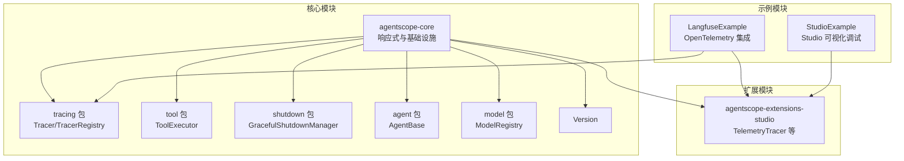
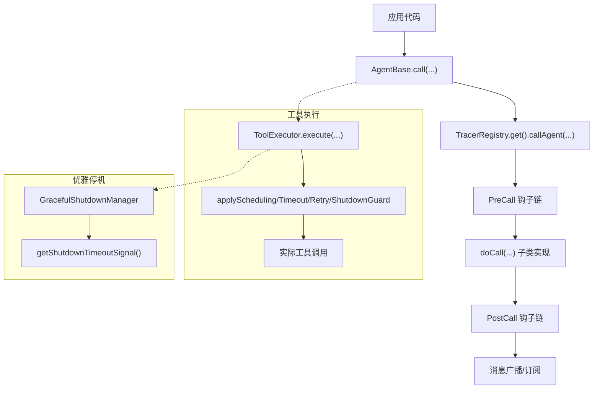
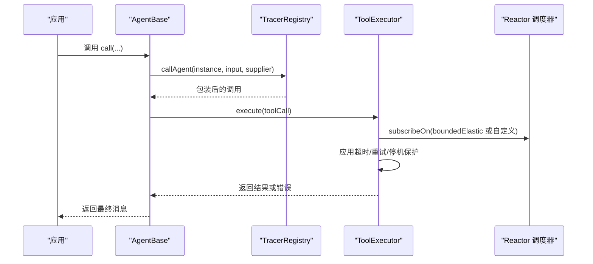
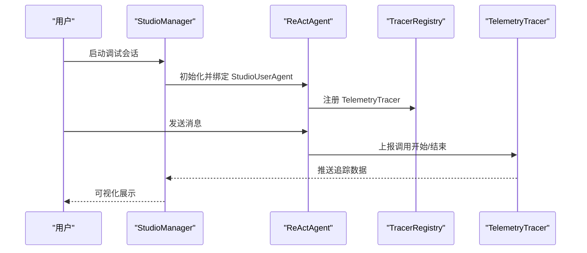
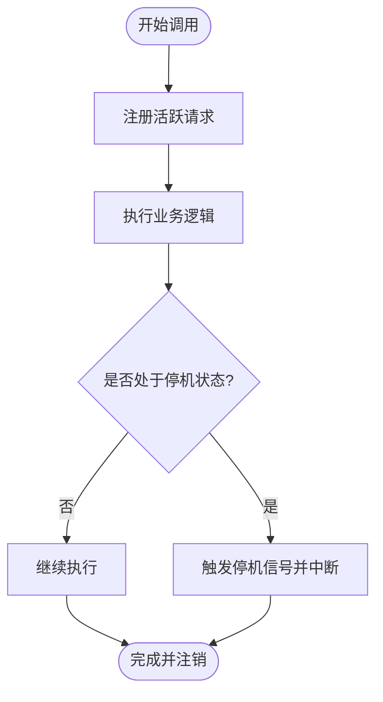
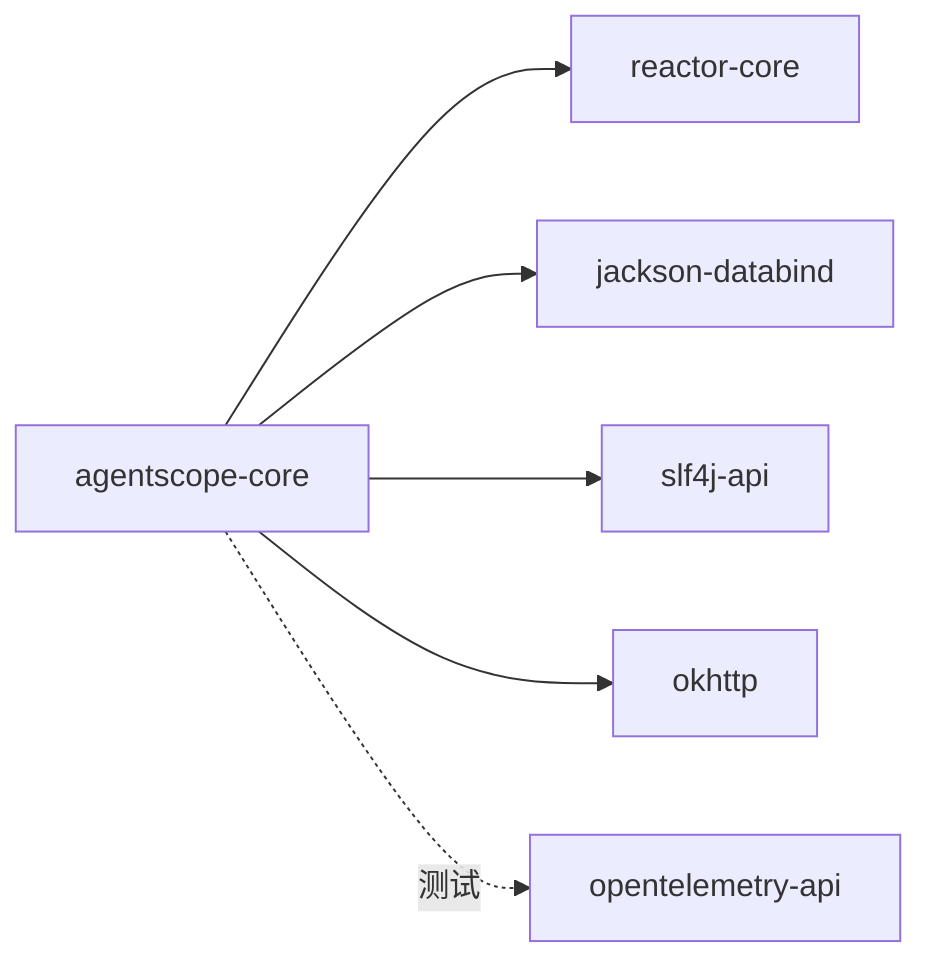

# 生产级特性

<cite>
**本文引用的文件**
- [Tracer.java](file://agentscope-core/src/main/java/io/agentscope/core/tracing/Tracer.java)
- [TracerRegistry.java](file://agentscope-core/src/main/java/io/agentscope/core/tracing/TracerRegistry.java)
- [NoopTracer.java](file://agentscope-core/src/main/java/io/agentscope/core/tracing/NoopTracer.java)
- [ToolExecutor.java](file://agentscope-core/src/main/java/io/agentscope/core/tool/ToolExecutor.java)
- [GracefulShutdownManager.java](file://agentscope-core/src/main/java/io/agentscope/core/shutdown/GracefulShutdownManager.java)
- [AgentBase.java](file://agentscope-core/src/main/java/io/agentscope/core/agent/AgentBase.java)
- [ModelRegistry.java](file://agentscope-core/src/main/java/io/agentscope/core/model/ModelRegistry.java)
- [Version.java](file://agentscope-core/src/main/java/io/agentscope/core/Version.java)
- [pom.xml](file://agentscope-core/pom.xml)
- [LangfuseExample.java](file://agentscope-examples/advanced/src/main/java/io/agentscope/examples/advanced/LangfuseExample.java)
- [StudioExample.java](file://agentscope-examples/advanced/src/main/java/io/agentscope/examples/advanced/StudioExample.java)
- [TelemetryTracer.java](file://agentscope-extensions/agentscope-extensions-studio/src/main/java/io/agentscope/core/tracing/telemetry/TelemetryTracer.java)
</cite>

## 目录
1. [引言](#引言)
2. [项目结构](#项目结构)
3. [核心组件](#核心组件)
4. [架构总览](#架构总览)
5. [详细组件分析](#详细组件分析)
6. [依赖分析](#依赖分析)
7. [性能考量](#性能考量)
8. [故障排查指南](#故障排查指南)
9. [结论](#结论)
10. [附录](#附录)

## 引言
本文件聚焦 AgentScope Java 框架的三大生产级保障：高性能（基于 Project Reactor 的响应式架构与调度）、安全沙箱（对不受信任工具代码的隔离执行）、可观测性（原生集成 OpenTelemetry 与 AgentScope Studio 可视化调试）。文档从代码层面解析这些能力的实现方式、运行机制与最佳实践，帮助读者在生产环境中稳定、可靠地部署与运维。

## 项目结构
AgentScope Java 将生产级特性分布在核心模块与扩展模块中：
- 核心模块提供响应式基础设施、工具执行器、优雅停机管理与追踪接口
- 扩展模块提供与 Studio 的集成与 TelemetryTracer 等观测能力
- 示例模块展示如何启用 Langfuse/OpenTelemetry 与 Studio 调试

图示来源
- [Tracer.java:35-68](file://agentscope-core/src/main/java/io/agentscope/core/tracing/Tracer.java#L35-L68)
- [TracerRegistry.java:40-153](file://agentscope-core/src/main/java/io/agentscope/core/tracing/TracerRegistry.java#L40-L153)
- [ToolExecutor.java:57-420](file://agentscope-core/src/main/java/io/agentscope/core/tool/ToolExecutor.java#L57-L420)
- [GracefulShutdownManager.java:41-320](file://agentscope-core/src/main/java/io/agentscope/core/shutdown/GracefulShutdownManager.java#L41-L320)
- [AgentBase.java:93-800](file://agentscope-core/src/main/java/io/agentscope/core/agent/AgentBase.java#L93-L800)
- [ModelRegistry.java:35-259](file://agentscope-core/src/main/java/io/agentscope/core/model/ModelRegistry.java#L35-L259)
- [Version.java:24-44](file://agentscope-core/src/main/java/io/agentscope/core/Version.java#L24-L44)
- [TelemetryTracer.java](file://agentscope-extensions/agentscope-extensions-studio/src/main/java/io/agentscope/core/tracing/telemetry/TelemetryTracer.java)

章节来源
- [pom.xml:51-154](file://agentscope-core/pom.xml#L51-L154)

## 核心组件
- 响应式与追踪接口：Tracer 定义统一的 callAgent/callModel/callTool/callFormat 钩子，TracerRegistry 提供全局注册与 Reactor 全局钩子以传播上下文
- 工具执行器：ToolExecutor 统一处理单次/批量工具调用，内置超时、重试、线程调度与优雅停机保护
- 优雅停机：GracefulShutdownManager 跟踪活跃请求、设置超时信号并在超时后强制中断
- Agent 基类：AgentBase 在 call 生命周期内集成钩子、中断、状态与追踪
- 模型注册：ModelRegistry 支持命名模型与工厂模式解析，内置多提供商自动创建
- 版本信息：Version 提供统一 User-Agent，便于统计与追踪

章节来源
- [Tracer.java:35-68](file://agentscope-core/src/main/java/io/agentscope/core/tracing/Tracer.java#L35-L68)
- [TracerRegistry.java:40-153](file://agentscope-core/src/main/java/io/agentscope/core/tracing/TracerRegistry.java#L40-L153)
- [ToolExecutor.java:57-420](file://agentscope-core/src/main/java/io/agentscope/core/tool/ToolExecutor.java#L57-L420)
- [GracefulShutdownManager.java:41-320](file://agentscope-core/src/main/java/io/agentscope/core/shutdown/GracefulShutdownManager.java#L41-L320)
- [AgentBase.java:93-800](file://agentscope-core/src/main/java/io/agentscope/core/agent/AgentBase.java#L93-L800)
- [ModelRegistry.java:35-259](file://agentscope-core/src/main/java/io/agentscope/core/model/ModelRegistry.java#L35-L259)
- [Version.java:24-44](file://agentscope-core/src/main/java/io/agentscope/core/Version.java#L24-L44)

## 架构总览
AgentScope 的生产级特性通过“响应式 + 追踪 + 执行器 + 优雅停机”的组合实现高吞吐、可观察与可恢复。

图示来源
- [AgentBase.java:182-201](file://agentscope-core/src/main/java/io/agentscope/core/agent/AgentBase.java#L182-L201)
- [TracerRegistry.java:139-152](file://agentscope-core/src/main/java/io/agentscope/core/tracing/TracerRegistry.java#L139-L152)
- [ToolExecutor.java:166-264](file://agentscope-core/src/main/java/io/agentscope/core/tool/ToolExecutor.java#L166-L264)
- [GracefulShutdownManager.java:93-95](file://agentscope-core/src/main/java/io/agentscope/core/shutdown/GracefulShutdownManager.java#L93-L95)

## 详细组件分析

### 高性能：响应式架构与调度
- 响应式基础：核心模块引入 Project Reactor（Flux/Mono），所有异步操作均基于 Reactor 的调度器与背压策略
- 调度策略：默认使用 boundedElastic 适配 I/O 密集型工具；支持自定义 ExecutorService 注入
- 超时与重试：ToolExecutor 内置超时与指数退避重试，避免资源泄露与雪崩效应
- 上下文传播：TracerRegistry 提供全局 Reactor 钩子，拦截 operator 创建并包裹 Subscriber，确保下游信号在正确 tracing 上下文中处理

图示来源
- [ToolExecutor.java:345-401](file://agentscope-core/src/main/java/io/agentscope/core/tool/ToolExecutor.java#L345-L401)
- [TracerRegistry.java:74-126](file://agentscope-core/src/main/java/io/agentscope/core/tracing/TracerRegistry.java#L74-L126)

章节来源
- [ToolExecutor.java:57-420](file://agentscope-core/src/main/java/io/agentscope/core/tool/ToolExecutor.java#L57-L420)
- [TracerRegistry.java:40-153](file://agentscope-core/src/main/java/io/agentscope/core/tracing/TracerRegistry.java#L40-L153)
- [pom.xml:52-56](file://agentscope-core/pom.xml#L52-L56)

### 安全沙箱：隔离执行不受信任的工具代码
- 设计目标：对不受信任的工具代码进行文件系统、进程与资源访问限制，防止越权与资源耗尽
- 实现思路（基于现有组件的扩展点）：
  - 文件系统隔离：通过抽象的 SandboxFilesystem 接口与具体实现（如内存沙箱、受限文件系统）控制工具可见的文件集合
  - 进程与资源保护：在 ToolExecutor 中注入执行守卫（如 RedisSandboxExecutionGuard），在工具执行前后校验与回收资源
  - 状态共享：通过 SharedInMemorySandboxStateStore 管理跨调用的状态，避免状态泄漏
  - 示例参考：示例模块中的 InMemorySandbox 与 WorkspaceClasspathMaterializer 展示了工作区材料化与内存沙箱的协作
- 关键要点：
  - 仅允许必要 API 访问，拒绝系统级权限
  - 限制 CPU/内存/IO 使用，结合超时与重试策略
  - 对工具输出进行严格验证与清洗

说明：本节为概念性设计说明，用于指导如何在现有框架上扩展安全沙箱能力。具体实现需结合 agentscope-harness 模块中的相关类进行扩展。

### 可观测性：OpenTelemetry 与 AgentScope Studio
- OpenTelemetry 集成：通过 TelemetryTracer 将 Agent、模型与工具调用的关键事件导出到 OTLP 端点（如 Langfuse）
- Studio 可视化：通过 StudioManager 与 StudioUserAgent 实现可视化调试与交互
- 示例演示：
  - LangfuseExample：初始化 TelemetryTracer 并注册到 TracerRegistry，随后进行多轮对话，所有调用均被追踪
  - StudioExample：连接 Studio，使用 WebSocket 与 StudioManager 协同，实现实时调试与会话可视化

图示来源
- [LangfuseExample.java:157-176](file://agentscope-examples/advanced/src/main/java/io/agentscope/examples/advanced/LangfuseExample.java#L157-L176)
- [StudioExample.java:36-43](file://agentscope-examples/advanced/src/main/java/io/agentscope/examples/advanced/StudioExample.java#L36-L43)
- [TelemetryTracer.java](file://agentscope-extensions/agentscope-extensions-studio/src/main/java/io/agentscope/core/tracing/telemetry/TelemetryTracer.java)

章节来源
- [LangfuseExample.java:51-224](file://agentscope-examples/advanced/src/main/java/io/agentscope/examples/advanced/LangfuseExample.java#L51-L224)
- [StudioExample.java:28-104](file://agentscope-examples/advanced/src/main/java/io/agentscope/examples/advanced/StudioExample.java#L28-L104)

### 优雅停机与中断：稳定退出与资源回收
- 全局管理：GracefulShutdownManager 跟踪活跃请求、设置超时信号并在超时后强制中断
- 请求生命周期：AgentBase 在 call 开始时注册请求，在结束时注销，并在执行过程中检查停机状态
- 工具保护：ToolExecutor 将工具执行与全局停机信号竞争，任一先完成即生效

图示来源
- [GracefulShutdownManager.java:198-266](file://agentscope-core/src/main/java/io/agentscope/core/shutdown/GracefulShutdownManager.java#L198-L266)
- [AgentBase.java:411-439](file://agentscope-core/src/main/java/io/agentscope/core/agent/AgentBase.java#L411-L439)
- [ToolExecutor.java:409-419](file://agentscope-core/src/main/java/io/agentscope/core/tool/ToolExecutor.java#L409-L419)

章节来源
- [GracefulShutdownManager.java:41-320](file://agentscope-core/src/main/java/io/agentscope/core/shutdown/GracefulShutdownManager.java#L41-L320)
- [AgentBase.java:93-536](file://agentscope-core/src/main/java/io/agentscope/core/agent/AgentBase.java#L93-L536)
- [ToolExecutor.java:345-419](file://agentscope-core/src/main/java/io/agentscope/core/tool/ToolExecutor.java#L345-L419)

## 依赖分析
- 核心依赖：Project Reactor（Flux/Mono）、Jackson（序列化）、SLF4J（日志）、OkHttp（HTTP 客户端）
- 观测性依赖：OpenTelemetry API（测试范围）
- 模型提供商：DashScope、Google Gemini、Anthropic、Ollama 等 SDK

图示来源
- [pom.xml:51-154](file://agentscope-core/pom.xml#L51-L154)

章节来源
- [pom.xml:33-49](file://agentscope-core/pom.xml#L33-L49)

## 性能考量
- 调度与并发
  - 默认使用 boundedElastic 适配 I/O 密集型任务；对 CPU 密集型任务建议注入自定义线程池
  - 批量工具执行支持串行/并行切换，按场景选择以平衡吞吐与资源占用
- 超时与重试
  - 为易失败的外部调用设置合理超时与退避重试，避免长时间阻塞
  - 结合优雅停机信号，确保在系统停机时快速失败并释放资源
- 上下文传播开销
  - 全局 Reactor 钩子会对所有 operator 生效，可能带来额外对象分配与上下文捕获/恢复成本
  - 仅在需要跨异步边界的追踪时启用，避免对非追踪路径造成影响
- 版本与 User-Agent
  - 使用统一的 Version.getUserAgent() 有助于平台侧识别客户端版本，便于性能对比与问题定位

章节来源
- [ToolExecutor.java:345-401](file://agentscope-core/src/main/java/io/agentscope/core/tool/ToolExecutor.java#L345-L401)
- [TracerRegistry.java:74-126](file://agentscope-core/src/main/java/io/agentscope/core/tracing/TracerRegistry.java#L74-L126)
- [Version.java:40-44](file://agentscope-core/src/main/java/io/agentscope/core/Version.java#L40-L44)

## 故障排查指南
- 追踪未生效
  - 确认已注册 TelemetryTracer 到 TracerRegistry，且 OTLP 端点与凭据正确
  - 检查全局 Reactor 钩子是否启用（如需跨异步边界的上下文传播）
- 工具执行超时或频繁重试
  - 调整 ExecutionConfig 的超时与重试参数，确认外部服务可用性
  - 检查是否存在与停机信号的竞争导致提前失败
- 优雅停机未生效
  - 确认 GracefulShutdownManager 的超时配置与监控线程正常运行
  - 检查工具执行是否正确接入停机保护（ToolExecutor.applyShutdownGuard）
- 中断异常
  - 确保在 AgentBase 的合适 checkpoint 调用 checkInterruptedAsync()
  - 检查 handleInterrupt 的实现是否保存状态并返回合理的中断消息

章节来源
- [LangfuseExample.java:157-176](file://agentscope-examples/advanced/src/main/java/io/agentscope/examples/advanced/LangfuseExample.java#L157-L176)
- [TracerRegistry.java:139-152](file://agentscope-core/src/main/java/io/agentscope/core/tracing/TracerRegistry.java#L139-L152)
- [ToolExecutor.java:352-419](file://agentscope-core/src/main/java/io/agentscope/core/tool/ToolExecutor.java#L352-L419)
- [GracefulShutdownManager.java:222-266](file://agentscope-core/src/main/java/io/agentscope/core/shutdown/GracefulShutdownManager.java#L222-L266)
- [AgentBase.java:372-379](file://agentscope-core/src/main/java/io/agentscope/core/agent/AgentBase.java#L372-L379)

## 结论
AgentScope Java 通过响应式架构、统一的工具执行器与优雅停机机制，构建了高性能、可恢复的执行环境；通过可插拔的追踪接口与 TelemetryTracer，实现了与 OpenTelemetry 生态的无缝对接；结合 Studio 的可视化调试能力，进一步提升了开发与运维效率。在生产环境中，建议根据业务特征调整调度策略、超时与重试参数，并谨慎启用全局上下文传播钩子，以获得最佳的性能与稳定性平衡。

## 附录
- 快速集成步骤（示例）
  - 启用 Langfuse 追踪：创建 TelemetryTracer 并注册到 TracerRegistry，随后进行 Agent 调用
  - 启用 Studio 调试：初始化 StudioManager，创建 StudioUserAgent 并与 Agent 协作
- 安全沙箱扩展建议
  - 基于 AbstractSandboxFilesystem 与 SandboxBackedFilesystem 实现受限文件系统
  - 在 ToolExecutor 中注入执行守卫，限制工具的资源使用
  - 使用共享状态存储管理跨调用状态，避免泄漏

章节来源
- [LangfuseExample.java:157-176](file://agentscope-examples/advanced/src/main/java/io/agentscope/examples/advanced/LangfuseExample.java#L157-L176)
- [StudioExample.java:36-43](file://agentscope-examples/advanced/src/main/java/io/agentscope/examples/advanced/StudioExample.java#L36-L43)