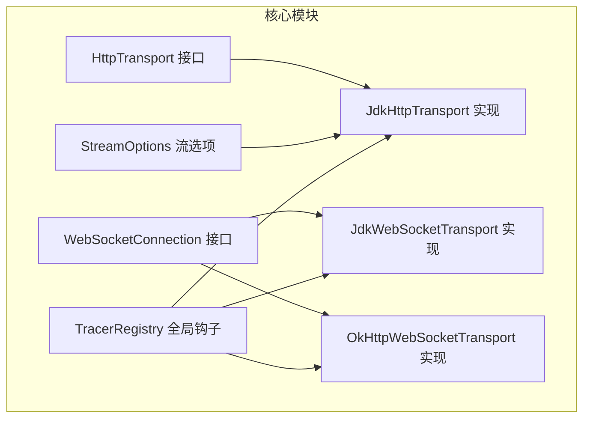
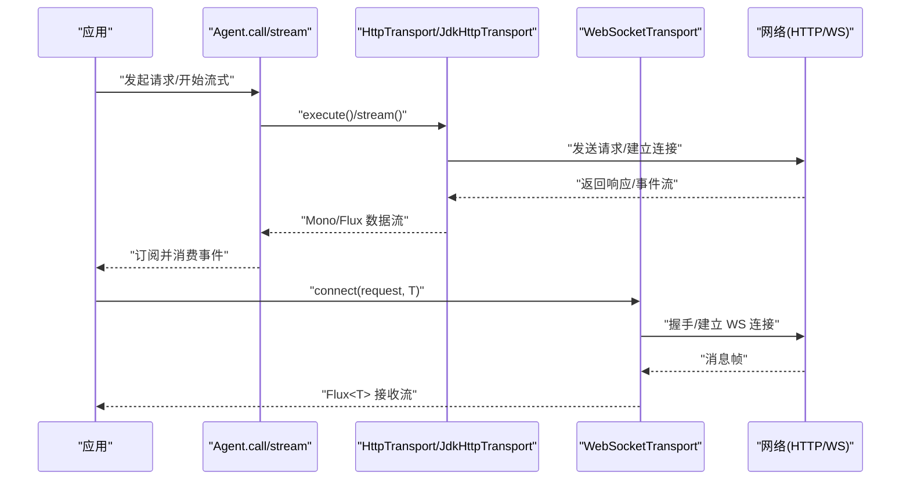
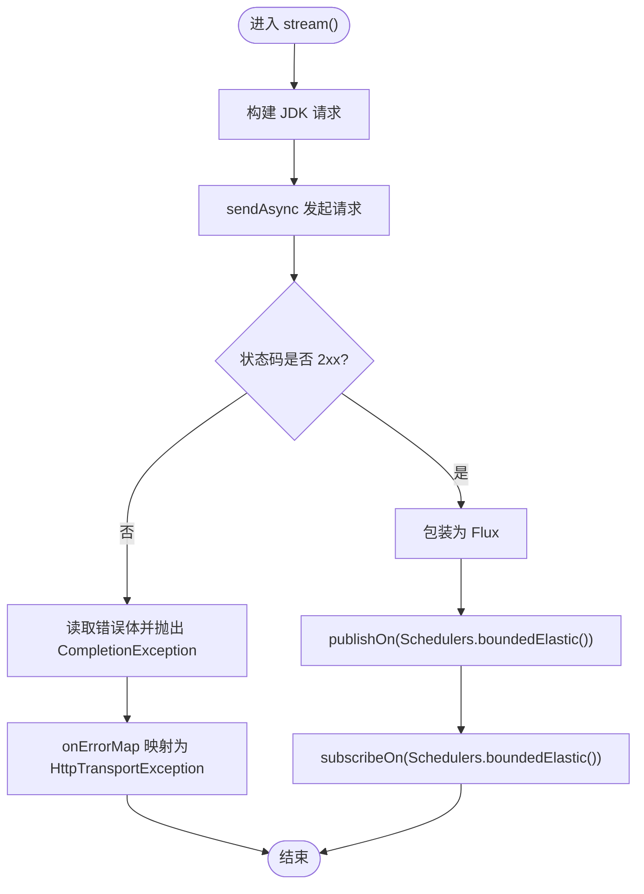
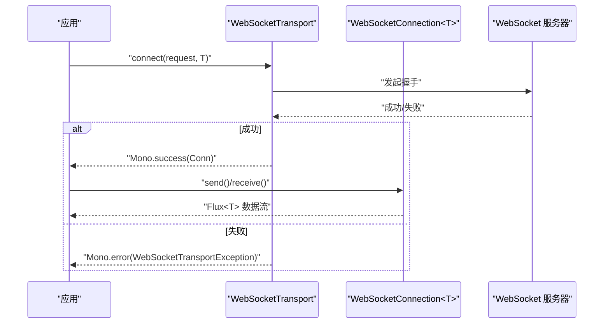
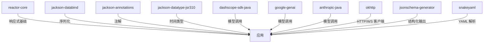

# 高性能响应式架构

<cite>
**本文引用的文件**   
- [agentscope-core/pom.xml](file://agentscope-core/pom.xml)
- [JdkHttpTransport.java](file://agentscope-core/src/main/java/io/agentscope/core/model/transport/JdkHttpTransport.java)
- [HttpTransport.java](file://agentscope-core/src/main/java/io/agentscope/core/model/transport/HttpTransport.java)
- [HttpTransportConfig.java](file://agentscope-core/src/main/java/io/agentscope/core/model/transport/HttpTransportConfig.java)
- [WebSocketConnection.java](file://agentscope-core/src/main/java/io/agentscope/core/model/transport/websocket/WebSocketConnection.java)
- [JdkWebSocketTransport.java](file://agentscope-core/src/main/java/io/agentscope/core/model/transport/websocket/JdkWebSocketTransport.java)
- [OkHttpWebSocketTransport.java](file://agentscope-core/src/main/java/io/agentscope/core/model/transport/websocket/OkHttpWebSocketTransport.java)
- [StreamOptions.java](file://agentscope-core/src/main/java/io/agentscope/core/agent/StreamOptions.java)
- [AgentPerformanceTest.java](file://agentscope-core/src/test/java/io/agentscope/core/agent/integration/AgentPerformanceTest.java)
- [TracerRegistry.java](file://agentscope-core/src/main/java/io/agentscope/core/tracing/TracerRegistry.java)
- [SKILL.md](file://SKILL.md)
</cite>

## 目录
1. [引言](#引言)
2. [项目结构](#项目结构)
3. [核心组件](#核心组件)
4. [架构总览](#架构总览)
5. [详细组件分析](#详细组件分析)
6. [依赖分析](#依赖分析)
7. [性能考量](#性能考量)
8. [故障排查指南](#故障排查指南)
9. [结论](#结论)
10. [附录](#附录)

## 引言
本文件面向 AgentScope Java 框架的高性能响应式架构，系统阐述基于 Project Reactor 的响应式编程模型在框架中的落地方式，覆盖 Mono/Flux 使用模式、背压与异步流式处理、HTTP 传输层（JDK HttpClient 与 OkHttp）实现、WebSocket 传输支持，以及与 GraalVM 原生镜像相关的注意事项。文档同时提供性能基准测试思路、内存优化策略、并发处理最佳实践，并通过图示与示例路径帮助读者正确使用响应式 API，规避常见性能陷阱。

## 项目结构
AgentScope 将响应式能力集中在核心模块中，围绕统一的传输接口抽象出可互换的 HTTP/WS 实现，结合流式事件选项与调度器配置，形成高吞吐、低延迟的异步处理管线。

图表来源
- [HttpTransport.java:1-63](file://agentscope-core/src/main/java/io/agentscope/core/model/transport/HttpTransport.java#L1-L63)
- [JdkHttpTransport.java:1-501](file://agentscope-core/src/main/java/io/agentscope/core/model/transport/JdkHttpTransport.java#L1-L501)
- [WebSocketConnection.java:1-152](file://agentscope-core/src/main/java/io/agentscope/core/model/transport/websocket/WebSocketConnection.java#L1-L152)
- [JdkWebSocketTransport.java:1-278](file://agentscope-core/src/main/java/io/agentscope/core/model/transport/websocket/JdkWebSocketTransport.java#L1-L278)
- [OkHttpWebSocketTransport.java:1-334](file://agentscope-core/src/main/java/io/agentscope/core/model/transport/websocket/OkHttpWebSocketTransport.java#L1-L334)
- [StreamOptions.java:1-371](file://agentscope-core/src/main/java/io/agentscope/core/agent/StreamOptions.java#L1-L371)
- [TracerRegistry.java:44-153](file://agentscope-core/src/main/java/io/agentscope/core/tracing/TracerRegistry.java#L44-L153)

章节来源
- [agentscope-core/pom.xml:52-136](file://agentscope-core/pom.xml#L52-L136)

## 核心组件
- 响应式基础：项目直接引入 Reactor Core 作为响应式运行时，所有网络与事件处理均以 Mono/Flux 形式组织，确保非阻塞与背压传播。
- 传输层抽象：HttpTransport 定义同步请求与 SSE 流式接口；JdkHttpTransport 提供纯 JDK 实现，OkHttp 作为可选实现（见依赖声明）。
- WebSocket 层：WebSocketConnection 抽象连接的发送/接收语义；JdkWebSocketTransport 与 OkHttpWebSocketTransport 分别基于 JDK 与 OkHttp 实现。
- 流式选项：StreamOptions 控制事件类型过滤、增量/累积模式及各类子事件（推理、工具执行、摘要）的包含策略。
- 调试与追踪：TracerRegistry 提供全局 Reactor 钩子，自动在操作符装配时传播上下文，便于跨异步边界的可观测性。

章节来源
- [agentscope-core/pom.xml:52-136](file://agentscope-core/pom.xml#L52-L136)
- [HttpTransport.java:1-63](file://agentscope-core/src/main/java/io/agentscope/core/model/transport/HttpTransport.java#L1-L63)
- [JdkHttpTransport.java:1-501](file://agentscope-core/src/main/java/io/agentscope/core/model/transport/JdkHttpTransport.java#L1-L501)
- [WebSocketConnection.java:1-152](file://agentscope-core/src/main/java/io/agentscope/core/model/transport/websocket/WebSocketConnection.java#L1-L152)
- [JdkWebSocketTransport.java:1-278](file://agentscope-core/src/main/java/io/agentscope/core/model/transport/websocket/JdkWebSocketTransport.java#L1-L278)
- [OkHttpWebSocketTransport.java:1-334](file://agentscope-core/src/main/java/io/agentscope/core/model/transport/websocket/OkHttpWebSocketTransport.java#L1-L334)
- [StreamOptions.java:1-371](file://agentscope-core/src/main/java/io/agentscope/core/agent/StreamOptions.java#L1-L371)
- [TracerRegistry.java:44-153](file://agentscope-core/src/main/java/io/agentscope/core/tracing/TracerRegistry.java#L44-L153)

## 架构总览
下图展示了从应用到传输层的典型调用链路，强调响应式链路的装配、订阅与错误传播。

图表来源
- [HttpTransport.java:33-62](file://agentscope-core/src/main/java/io/agentscope/core/model/transport/HttpTransport.java#L33-L62)
- [JdkHttpTransport.java:190-240](file://agentscope-core/src/main/java/io/agentscope/core/model/transport/JdkHttpTransport.java#L190-L240)
- [JdkWebSocketTransport.java:195-240](file://agentscope-core/src/main/java/io/agentscope/core/model/transport/websocket/JdkWebSocketTransport.java#L195-L240)
- [OkHttpWebSocketTransport.java:200-296](file://agentscope-core/src/main/java/io/agentscope/core/model/transport/websocket/OkHttpWebSocketTransport.java#L200-L296)

## 详细组件分析

### 组件一：JDK HTTP 传输（JdkHttpTransport）
- 设计要点
  - 基于 JDK HttpClient 的纯 JDK 实现，无额外外部依赖。
  - 同步请求 execute() 返回 HttpResponse；流式请求 stream() 返回 Flux<String>，内部解析 SSE/NDJSON。
  - 内置连接池、HTTP/2 支持、超时与代理配置。
- 响应式与背压
  - 使用 Mono/Flux 包装异步完成与流式数据，通过 publishOn/subscribeOn 切换调度器，避免阻塞线程。
  - 对异常进行映射与包装，保证错误沿响应式链路传播。
- 资源管理
  - 通过 AtomicBoolean 管理关闭状态；HttpClient 生命周期由 JDK 管理，无需显式关闭。

图表来源
- [JdkHttpTransport.java:190-240](file://agentscope-core/src/main/java/io/agentscope/core/model/transport/JdkHttpTransport.java#L190-L240)
- [JdkHttpTransport.java:242-276](file://agentscope-core/src/main/java/io/agentscope/core/model/transport/JdkHttpTransport.java#L242-L276)

章节来源
- [JdkHttpTransport.java:53-94](file://agentscope-core/src/main/java/io/agentscope/core/model/transport/JdkHttpTransport.java#L53-L94)
- [JdkHttpTransport.java:190-240](file://agentscope-core/src/main/java/io/agentscope/core/model/transport/JdkHttpTransport.java#L190-L240)
- [JdkHttpTransport.java:242-276](file://agentscope-core/src/main/java/io/agentscope/core/model/transport/JdkHttpTransport.java#L242-L276)
- [HttpTransport.java:20-62](file://agentscope-core/src/main/java/io/agentscope/core/model/transport/HttpTransport.java#L20-L62)
- [HttpTransportConfig.java:26-131](file://agentscope-core/src/main/java/io/agentscope/core/model/transport/HttpTransportConfig.java#L26-L131)

### 组件二：WebSocket 传输（JdkWebSocketTransport 与 OkHttpWebSocketTransport）
- 设计要点
  - WebSocketConnection 接口统一文本与二进制协议的消息收发；实现分别基于 JDK 与 OkHttp。
  - 支持代理、认证、SSL 忽略等高级配置；OkHttp 版本内置心跳（pingInterval）。
- 响应式与背压
  - connect() 返回 Mono<WebSocketConnection<T>>，内部使用 Mono.create 包装异步握手；接收流使用 Flux<T> 暴露。
  - 错误通过 WebSocketTransportException 上下文化封装，便于定位连接阶段与运行期异常。
- 资源管理
  - JDK 实现不强制关闭；OkHttp 实现提供 dispatcher 与连接池清理方法。

图表来源
- [WebSocketConnection.java:81-151](file://agentscope-core/src/main/java/io/agentscope/core/model/transport/websocket/WebSocketConnection.java#L81-L151)
- [JdkWebSocketTransport.java:195-240](file://agentscope-core/src/main/java/io/agentscope/core/model/transport/websocket/JdkWebSocketTransport.java#L195-L240)
- [OkHttpWebSocketTransport.java:200-296](file://agentscope-core/src/main/java/io/agentscope/core/model/transport/websocket/OkHttpWebSocketTransport.java#L200-L296)

章节来源
- [WebSocketConnection.java:21-151](file://agentscope-core/src/main/java/io/agentscope/core/model/transport/websocket/WebSocketConnection.java#L21-L151)
- [JdkWebSocketTransport.java:45-113](file://agentscope-core/src/main/java/io/agentscope/core/model/transport/websocket/JdkWebSocketTransport.java#L45-L113)
- [OkHttpWebSocketTransport.java:47-119](file://agentscope-core/src/main/java/io/agentscope/core/model/transport/websocket/OkHttpWebSocketTransport.java#L47-L119)

### 组件三：流式选项（StreamOptions）
- 设计要点
  - 控制事件类型集合、增量/累积模式，以及推理、工具执行、摘要等子事件的包含策略。
  - 提供默认配置与构建器，便于按需裁剪流输出，降低带宽与处理开销。
- 使用建议
  - 在高频流场景中，建议仅启用必要 EventType，并关闭不需要的中间结果，提升端到端延迟。

章节来源
- [StreamOptions.java:23-129](file://agentscope-core/src/main/java/io/agentscope/core/agent/StreamOptions.java#L23-L129)
- [StreamOptions.java:253-371](file://agentscope-core/src/main/java/io/agentscope/core/agent/StreamOptions.java#L253-L371)

### 组件四：全局追踪钩子（TracerRegistry）
- 设计要点
  - 通过 Hooks.onEachOperator 注册全局 Reactor 钩子，在每个操作符装配时包裹 Subscriber，确保信号回调在正确的上下文中执行。
  - 可动态启用/禁用，注册 Tracer 时根据实现切换钩子状态。
- 性能提示
  - 全局钩子会对 JVM 中所有 Reactor 操作符引入额外开销，应在需要跨异步边界的上下文传播时启用。

章节来源
- [TracerRegistry.java:44-153](file://agentscope-core/src/main/java/io/agentscope/core/tracing/TracerRegistry.java#L44-L153)

## 依赖分析
- 响应式运行时：reactor-core
- JSON 序列化：jackson-databind、jackson-annotations、jackson-datatype-jsr310
- 模型 SDK：DashScope、Google Gemini、Anthropic
- HTTP 客户端：okhttp（可选，用于 WebSocket 与 HTTP 场景）
- 其他：jsonschema-generator、snakeyaml、opentelemetry-api（测试）

图表来源
- [agentscope-core/pom.xml:52-147](file://agentscope-core/pom.xml#L52-L147)

章节来源
- [agentscope-core/pom.xml:52-147](file://agentscope-core/pom.xml#L52-L147)

## 性能考量
- 响应式与背压
  - 避免在响应式链中使用 block() 或 Thread.sleep() 等阻塞操作；使用 Mono.delay/Flux.interval 等非阻塞替代。
  - 正确使用 publishOn/subscribeOn 切换调度器，防止阻塞 I/O 占用默认弹性线程池。
- 资源与连接
  - 复用 HttpClient/OkHttpClient 实例，利用内置连接池；合理设置超时与空闲保活参数。
  - WebSocket 连接池与心跳（OkHttp）有助于维持长连接稳定性。
- 流裁剪
  - 使用 StreamOptions 仅保留必要事件类型与中间结果，减少网络与 CPU 开销。
- 并发与调度
  - 在并发管道中为不同阶段选择合适的 Scheduler，避免线程饥饿；测试中可使用 VirtualTimeScheduler 进行确定性验证。
- 基准测试
  - 提供集成性能测试样例，覆盖并发代理、大内存场景与响应时间指标，可用于回归与容量规划。

章节来源
- [SKILL.md:715-772](file://SKILL.md#L715-L772)
- [AgentPerformanceTest.java:73-228](file://agentscope-core/src/test/java/io/agentscope/core/agent/integration/AgentPerformanceTest.java#L73-L228)

## 故障排查指南
- 常见错误与修复
  - 阻塞操作：将 block() 替换为非阻塞延时或条件发射。
  - 静默失败：避免 onErrorResume 返回空 Mono，应记录日志并返回兜底值。
  - 上下文丢失：避免使用 ThreadLocal，改用 Mono.deferContextual 传递上下文。
  - 资源泄漏：确保正确关闭传输层实例；WebSocket 连接在不再使用时及时关闭。
- 日志与追踪
  - 传输层实现对连接、消息、错误进行分级日志记录，便于定位问题。
  - 启用全局追踪钩子以捕获跨异步边界的上下文信息。

章节来源
- [SKILL.md:715-860](file://SKILL.md#L715-L860)
- [JdkHttpTransport.java:190-240](file://agentscope-core/src/main/java/io/agentscope/core/model/transport/JdkHttpTransport.java#L190-L240)
- [JdkWebSocketTransport.java:195-240](file://agentscope-core/src/main/java/io/agentscope/core/model/transport/websocket/JdkWebSocketTransport.java#L195-L240)
- [OkHttpWebSocketTransport.java:200-296](file://agentscope-core/src/main/java/io/agentscope/core/model/transport/websocket/OkHttpWebSocketTransport.java#L200-L296)

## 结论
AgentScope Java 通过清晰的传输层抽象与响应式实现，提供了高性能、可扩展的异步通信能力。JDK 与 OkHttp 的双栈支持满足多样部署需求；配合流式选项与全局追踪钩子，可在保证可观测性的同时实现低延迟与高吞吐。遵循阻塞避免、资源复用与流裁剪等最佳实践，可进一步提升系统整体性能与稳定性。

## 附录
- 示例参考路径
  - HTTP 流式请求：[JdkHttpTransport.stream:190-240](file://agentscope-core/src/main/java/io/agentscope/core/model/transport/JdkHttpTransport.java#L190-L240)
  - WebSocket 连接与收发：[JdkWebSocketTransport.connect:195-240](file://agentscope-core/src/main/java/io/agentscope/core/model/transport/websocket/JdkWebSocketTransport.java#L195-L240)、[OkHttpWebSocketTransport.connect:200-296](file://agentscope-core/src/main/java/io/agentscope/core/model/transport/websocket/OkHttpWebSocketTransport.java#L200-L296)
  - 流式选项配置：[StreamOptions.builder:253-371](file://agentscope-core/src/main/java/io/agentscope/core/agent/StreamOptions.java#L253-L371)
  - 全局追踪钩子：[TracerRegistry.enableTracingHook:74-126](file://agentscope-core/src/main/java/io/agentscope/core/tracing/TracerRegistry.java#L74-L126)
  - 性能测试样例：[AgentPerformanceTest:73-228](file://agentscope-core/src/test/java/io/agentscope/core/agent/integration/AgentPerformanceTest.java#L73-L228)