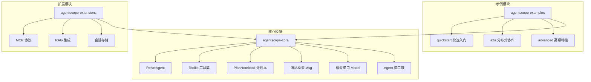
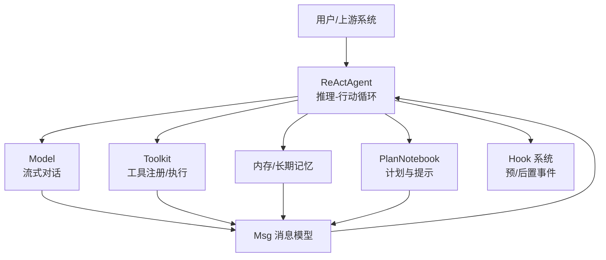
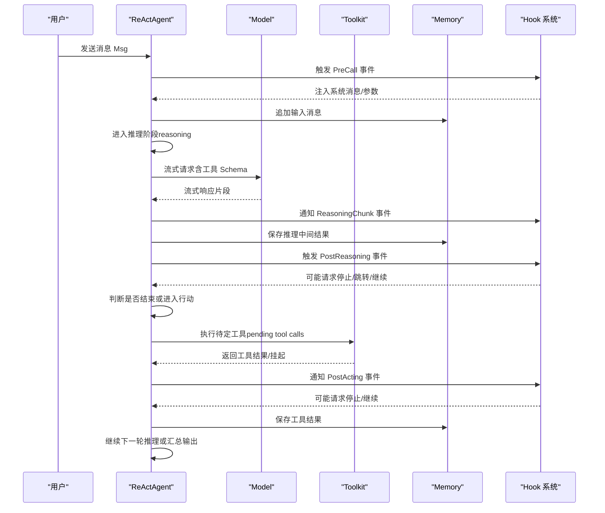
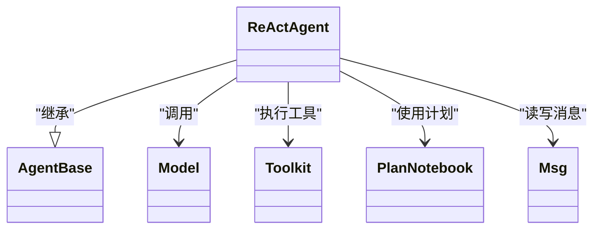

# 框架介绍

<cite>
**本文引用的文件**
- [README.md](file://README.md)
- [ReActAgent.java](file://agentscope-core/src/main/java/io/agentscope/core/ReActAgent.java)
- [AgentBase.java](file://agentscope-core/src/main/java/io/agentscope/core/agent/AgentBase.java)
- [Agent.java](file://agentscope-core/src/main/java/io/agentscope/core/agent/Agent.java)
- [Toolkit.java](file://agentscope-core/src/main/java/io/agentscope/core/tool/Toolkit.java)
- [PlanNotebook.java](file://agentscope-core/src/main/java/io/agentscope/core/plan/PlanNotebook.java)
- [Msg.java](file://agentscope-core/src/main/java/io/agentscope/core/message/Msg.java)
- [Model.java](file://agentscope-core/src/main/java/io/agentscope/core/model/Model.java)
- [Version.java](file://agentscope-core/src/main/java/io/agentscope/core/Version.java)
- [pom.xml](file://agentscope-examples/quickstart/pom.xml)
</cite>

## 目录
1. [引言](#引言)
2. [项目结构](#项目结构)
3. [核心组件](#核心组件)
4. [架构总览](#架构总览)
5. [详细组件分析](#详细组件分析)
6. [依赖关系分析](#依赖关系分析)
7. [性能与可扩展性](#性能与可扩展性)
8. [故障排查指南](#故障排查指南)
9. [结论](#结论)
10. [附录](#附录)

## 引言
AgentScope Java 是面向生产的 LLM 应用智能体开发框架，以 ReAct（推理-行动）范式为核心，提供从“思考”到“执行”的闭环能力：支持工具调用、记忆管理、多智能体协作、结构化输出、RAG 知识增强等关键能力，并在生产级可观测性、安全沙箱、优雅停机等方面提供工程化保障。框架强调“有控制的自治”，既允许智能体自主决策，又提供中断、取消、人机协同（HITL）等干预机制，适合复杂业务场景下的实时决策与动态适配。

## 项目结构
AgentScope Java 采用模块化分层设计：
- 核心模块（agentscope-core）：定义智能体抽象、消息模型、工具系统、计划本、内存、模型接口、Hook 体系、会话与状态持久化等
- 示例模块（agentscope-examples）：覆盖快速入门、A2A 分布式、RAG、多智能体模式、HITL 等典型场景
- 扩展模块（agentscope-extensions）：提供 MCP 协议、RAG 集成、会话存储、调度器、Spring Boot Starter 等生态能力

图示来源
- [AgentBase.java](file://agentscope-core/src/main/java/io/agentscope/core/agent/AgentBase.java)
- [ReActAgent.java](file://agentscope-core/src/main/java/io/agentscope/core/ReActAgent.java)
- [Toolkit.java](file://agentscope-core/src/main/java/io/agentscope/core/tool/Toolkit.java)
- [PlanNotebook.java](file://agentscope-core/src/main/java/io/agentscope/core/plan/PlanNotebook.java)
- [Msg.java](file://agentscope-core/src/main/java/io/agentscope/core/message/Msg.java)
- [Model.java](file://agentscope-core/src/main/java/io/agentscope/core/model/Model.java)

章节来源
- [README.md](file://README.md)
- [pom.xml](file://agentscope-examples/quickstart/pom.xml)

## 核心组件
- ReActAgent：实现 ReAct 推理-行动循环，支持 Hook 流水线、结构化输出、计划本、长程记忆、工具组态与外部工具挂起等
- AgentBase：统一的 Agent 基类，提供钩子集成、中断机制、运行时上下文绑定、订阅广播等基础设施
- Toolkit：工具注册、分组、Schema 生成、MCP 客户端、并行/串行执行、结果转换与回调
- PlanNotebook：结构化任务管理，自动注入提示，跟踪子任务状态，支持历史计划恢复
- Msg：消息载体，支持文本、图像、音频、视频、思维块、工具调用/结果块等多模态内容
- Model：统一的模型接口，负责消息格式化与流式响应
- 版本信息：统一 User-Agent，便于追踪与统计

章节来源
- [ReActAgent.java](file://agentscope-core/src/main/java/io/agentscope/core/ReActAgent.java)
- [AgentBase.java](file://agentscope-core/src/main/java/io/agentscope/core/agent/AgentBase.java)
- [Toolkit.java](file://agentscope-core/src/main/java/io/agentscope/core/tool/Toolkit.java)
- [PlanNotebook.java](file://agentscope-core/src/main/java/io/agentscope/core/plan/PlanNotebook.java)
- [Msg.java](file://agentscope-core/src/main/java/io/agentscope/core/message/Msg.java)
- [Model.java](file://agentscope-core/src/main/java/io/agentscope/core/model/Model.java)
- [Version.java](file://agentscope-core/src/main/java/io/agentscope/core/Version.java)

## 架构总览
AgentScope 的整体架构围绕“消息驱动 + Hook 可观测 + 工具执行 + 记忆与计划”的闭环展开。ReActAgent 作为核心执行器，串联模型、工具、记忆与计划模块；AgentBase 提供统一的生命周期与中断控制；Toolkit 负责工具注册与执行；PlanNotebook 提供结构化任务编排；Msg 作为跨组件的数据契约。

图示来源
- [ReActAgent.java](file://agentscope-core/src/main/java/io/agentscope/core/ReActAgent.java)
- [AgentBase.java](file://agentscope-core/src/main/java/io/agentscope/core/agent/AgentBase.java)
- [Toolkit.java](file://agentscope-core/src/main/java/io/agentscope/core/tool/Toolkit.java)
- [PlanNotebook.java](file://agentscope-core/src/main/java/io/agentscope/core/plan/PlanNotebook.java)
- [Msg.java](file://agentscope-core/src/main/java/io/agentscope/core/message/Msg.java)
- [Model.java](file://agentscope-core/src/main/java/io/agentscope/core/model/Model.java)

## 详细组件分析

### ReAct 推理-行动循环与动态决策
ReActAgent 将“推理（思考+规划）”与“行动（工具调用）”交替进行，直至满足终止条件或达到最大迭代次数。其核心流程如下：

图示来源
- [ReActAgent.java](file://agentscope-core/src/main/java/io/agentscope/core/ReActAgent.java)
- [AgentBase.java](file://agentscope-core/src/main/java/io/agentscope/core/agent/AgentBase.java)
- [Toolkit.java](file://agentscope-core/src/main/java/io/agentscope/core/tool/Toolkit.java)
- [Msg.java](file://agentscope-core/src/main/java/io/agentscope/core/message/Msg.java)

章节来源
- [ReActAgent.java](file://agentscope-core/src/main/java/io/agentscope/core/ReActAgent.java)

### 与传统工作流方法的对比
- 动态适应性：ReAct 循环按需选择工具与策略，而非固化步骤；当外部条件变化时，智能体可即时调整路径
- 实时决策：基于流式模型响应与 Hook 干预，支持 HITL（人机协同）在任一阶段介入
- 可观测与可控：统一 Hook 事件、中断与优雅停机，避免“黑盒”式执行
- 对比传统工作流：后者通常以固定流程节点推进，难以应对复杂、不确定的现实场景；AgentScope 更贴近真实业务的“边做边想、边想边做”

### 设计哲学与技术选型
- 响应式与非阻塞：基于 Project Reactor，保证高并发与低延迟
- Hook 可观测：贯穿 call 生命周期，便于调试、监控与干预
- 工具即能力：通过 Toolkit 与工具 Schema，将外部能力以统一方式接入
- 结构化输出：内置结构化解析与自修正，降低后处理成本
- 安全与隔离：运行时沙箱与工具挂起机制，防止未授权访问
- 生产就绪：版本统一 User-Agent、可观测性集成、优雅停机与会话持久化

章节来源
- [AgentBase.java](file://agentscope-core/src/main/java/io/agentscope/core/agent/AgentBase.java)
- [Version.java](file://agentscope-core/src/main/java/io/agentscope/core/Version.java)

### 适用场景
- 复杂任务分解与执行：借助 PlanNotebook 将大任务拆解为有序子任务
- 多轮对话与上下文管理：结合内存与结构化输出，稳定维护对话状态
- 工具密集型应用：通过 Toolkit 管理工具注册、分组与执行策略
- 人机协同与监管：在关键节点引入人工审核与修正
- 多智能体协作：配合 A2A 协议与服务发现，实现智能体间自然调用

章节来源
- [PlanNotebook.java](file://agentscope-core/src/main/java/io/agentscope/core/plan/PlanNotebook.java)
- [Toolkit.java](file://agentscope-core/src/main/java/io/agentscope/core/tool/Toolkit.java)
- [README.md](file://README.md)

## 依赖关系分析
- ReActAgent 依赖 AgentBase（生命周期与中断）、Model（对话能力）、Toolkit（工具执行）、Memory/PlanNotebook（记忆与计划）、Hook（可观测）
- Toolkit 内部协调 ToolRegistry、ToolGroupManager、ToolSchemaProvider、McpClientManager、ToolExecutor 等子模块
- Msg 作为跨模块数据契约，贯穿推理、行动、记忆与 Hook

图示来源
- [AgentBase.java](file://agentscope-core/src/main/java/io/agentscope/core/agent/AgentBase.java)
- [ReActAgent.java](file://agentscope-core/src/main/java/io/agentscope/core/ReActAgent.java)
- [Toolkit.java](file://agentscope-core/src/main/java/io/agentscope/core/tool/Toolkit.java)
- [PlanNotebook.java](file://agentscope-core/src/main/java/io/agentscope/core/plan/PlanNotebook.java)
- [Msg.java](file://agentscope-core/src/main/java/io/agentscope/core/message/Msg.java)
- [Model.java](file://agentscope-core/src/main/java/io/agentscope/core/model/Model.java)

章节来源
- [AgentBase.java](file://agentscope-core/src/main/java/io/agentscope/core/agent/AgentBase.java)
- [ReActAgent.java](file://agentscope-core/src/main/java/io/agentscope/core/ReActAgent.java)
- [Toolkit.java](file://agentscope-core/src/main/java/io/agentscope/core/tool/Toolkit.java)
- [PlanNotebook.java](file://agentscope-core/src/main/java/io/agentscope/core/plan/PlanNotebook.java)
- [Msg.java](file://agentscope-core/src/main/java/io/agentscope/core/message/Msg.java)
- [Model.java](file://agentscope-core/src/main/java/io/agentscope/core/model/Model.java)

## 性能与可扩展性
- 非阻塞执行：基于 Reactor 的响应式模型，减少线程阻塞，提升吞吐
- 工具执行优化：支持并行/串行配置、超时与重试策略合并，降低尾延迟
- 结构化输出：自修正解析减少人工兜底，提高端到端稳定性
- 观测与诊断：OpenTelemetry 集成与 Hook 事件，便于定位瓶颈
- 扩展性：MCP 协议、RAG 集成、会话存储、调度器等扩展模块可按需启用

## 故障排查指南
- 中断与优雅停机：ReActAgent 在关键检查点检测中断信号，支持系统/用户来源区分；必要时根据策略丢弃部分推理或保留中间结果
- 工具异常处理：工具执行失败时生成错误结果，避免中断整个流程；同时记录错误信息用于后续修复
- Hook 干预：通过 Pre/Post Reasoning/Acting/Summary 等事件，可在任意阶段暂停、修改或跳转
- 会话与状态：利用 Session 与 StateModule 接口保存/恢复 Agent 元数据、工具组态与计划状态，便于重启与回放

章节来源
- [AgentBase.java](file://agentscope-core/src/main/java/io/agentscope/core/agent/AgentBase.java)
- [ReActAgent.java](file://agentscope-core/src/main/java/io/agentscope/core/ReActAgent.java)

## 结论
AgentScope Java 以 ReAct 为核心范式，构建了“可观察、可干预、可扩展”的智能体工程平台。它在保持灵活性的同时，提供了生产级的中断、取消、HITL、可观测与安全隔离能力，适用于需要动态适应与实时决策的复杂应用场景。通过模块化设计与丰富的扩展生态，开发者可以快速搭建从简单问答到多智能体协作的多样化应用。

## 附录
- 快速开始与依赖：示例工程展示了如何引入 agentscope-core 与相关扩展模块，便于快速验证核心能力
- 版本与标识：统一的版本号与 User-Agent 有助于在多环境与多版本共存时进行追踪与统计

章节来源
- [README.md](file://README.md)
- [pom.xml](file://agentscope-examples/quickstart/pom.xml)
- [Version.java](file://agentscope-core/src/main/java/io/agentscope/core/Version.java)