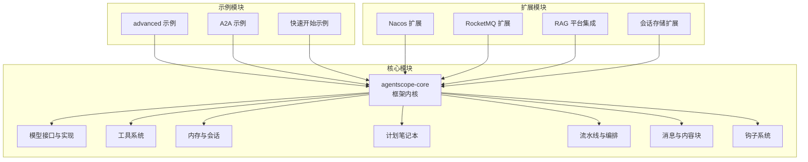
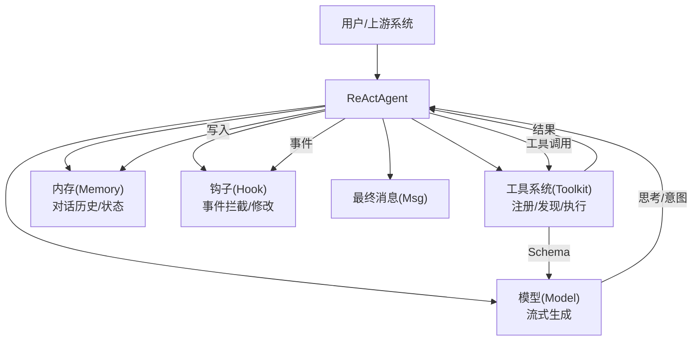
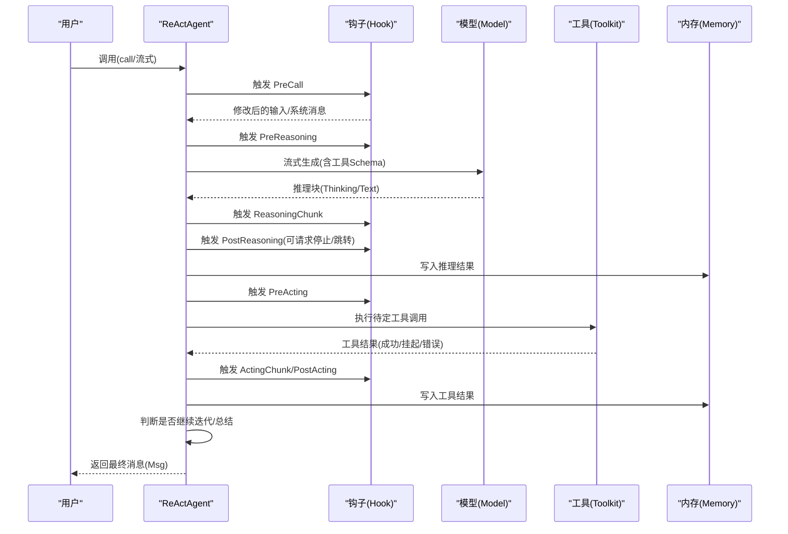
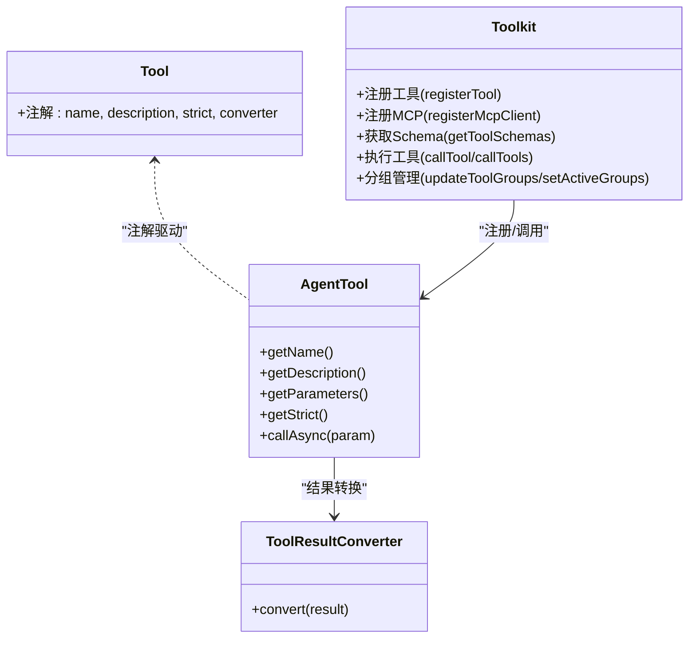
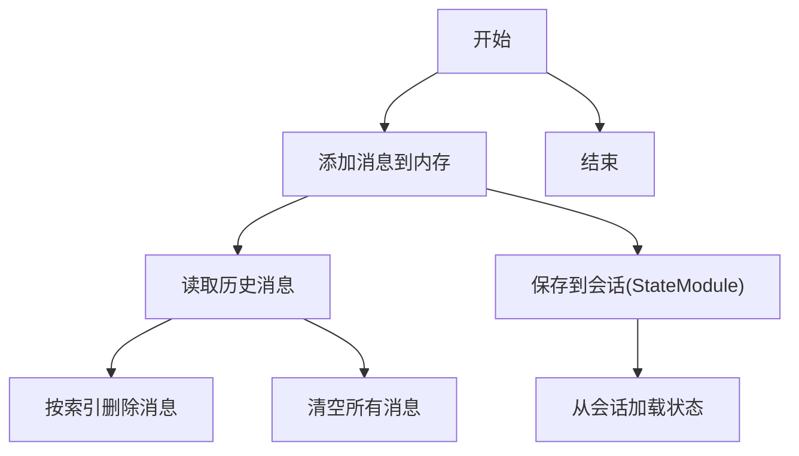
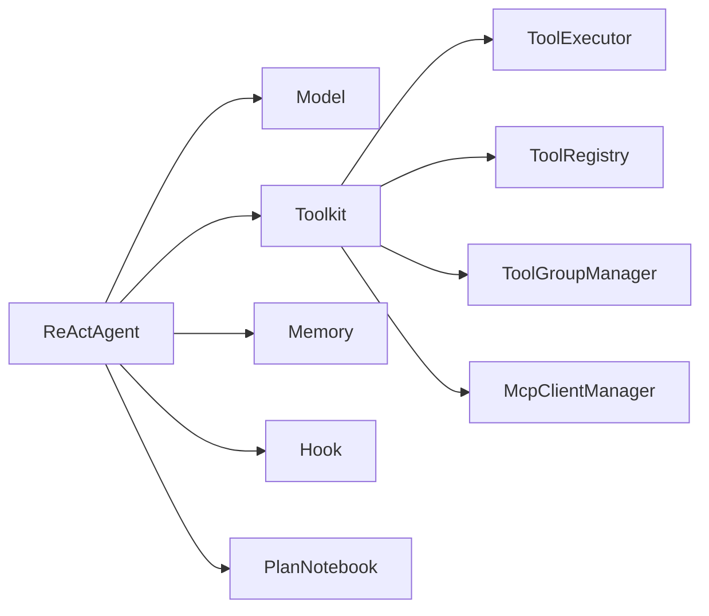

# 项目概述

<cite>
**本文引用的文件**
- [README.md](file://README.md)
- [ReActAgent.java](file://agentscope-core/src/main/java/io/agentscope/core/ReActAgent.java)
- [AgentBase.java](file://agentscope-core/src/main/java/io/agentscope/core/agent/AgentBase.java)
- [Tool.java](file://agentscope-core/src/main/java/io/agentscope/core/tool/Tool.java)
- [Toolkit.java](file://agentscope-core/src/main/java/io/agentscope/core/tool/Toolkit.java)
- [Memory.java](file://agentscope-core/src/main/java/io/agentscope/core/memory/Memory.java)
- [Model.java](file://agentscope-core/src/main/java/io/agentscope/core/model/Model.java)
- [Pipeline.java](file://agentscope-core/src/main/java/io/agentscope/core/pipeline/Pipeline.java)
- [PlanNotebook.java](file://agentscope-core/src/main/java/io/agentscope/core/plan/PlanNotebook.java)
- [Hook.java](file://agentscope-core/src/main/java/io/agentscope/core/hook/Hook.java)
- [Msg.java](file://agentscope-core/src/main/java/io/agentscope/core/message/Msg.java)
- [Version.java](file://agentscope-core/src/main/java/io/agentscope/core/Version.java)
- [RAGExample.java](file://agentscope-examples/advanced/src/main/java/io/agentscope/examples/advanced/RAGExample.java)
</cite>

## 目录
1. [引言](#引言)
2. [项目结构](#项目结构)
3. [核心组件](#核心组件)
4. [架构总览](#架构总览)
5. [详细组件分析](#详细组件分析)
6. [依赖分析](#依赖分析)
7. [性能考虑](#性能考虑)
8. [故障排查指南](#故障排查指南)
9. [结论](#结论)
10. [附录](#附录)

## 引言
AgentScope Java 是一个面向生产的 LLM 应用智能体开发框架，围绕 ReAct（推理-行动）范式构建，提供工具调用、内存管理、多智能体协作、结构化输出、RAG 等能力，并通过 Hook 机制实现可观测性与可干预性。其设计目标是在保证生产可用性的前提下，赋予开发者对复杂任务执行过程的完全控制权：支持安全中断、优雅取消、人机协同（HITL）、长时记忆与检索增强生成（RAG），以及与 MCP/A2A 协议生态的无缝集成。

框架强调“有控制的自治”，既允许智能体自主决策，又通过运行时干预与状态持久化保障企业级稳定性与可审计性。基于 Project Reactor 的响应式架构，配合可选的 GraalVM 原生镜像，满足高并发与低延迟场景需求。

## 项目结构
仓库采用模块化组织，核心模块 agentscope-core 提供框架内核；examples 提供丰富的示例工程；extensions 提供与外部生态（如 Nacos、RocketMQ、RAG 平台、会话存储等）的扩展；distribution 提供打包与依赖管理；docs 提供中英文文档。

图表来源
- [README.md](file://README.md)
- [ReActAgent.java](file://agentscope-core/src/main/java/io/agentscope/core/ReActAgent.java)
- [Toolkit.java](file://agentscope-core/src/main/java/io/agentscope/core/tool/Toolkit.java)
- [Memory.java](file://agentscope-core/src/main/java/io/agentscope/core/memory/Memory.java)
- [PlanNotebook.java](file://agentscope-core/src/main/java/io/agentscope/core/plan/PlanNotebook.java)
- [Pipeline.java](file://agentscope-core/src/main/java/io/agentscope/core/pipeline/Pipeline.java)
- [Hook.java](file://agentscope-core/src/main/java/io/agentscope/core/hook/Hook.java)
- [Msg.java](file://agentscope-core/src/main/java/io/agentscope/core/message/Msg.java)

章节来源
- [README.md](file://README.md)

## 核心组件
- ReActAgent：实现 ReAct 推理-行动循环，支持流式推理、工具调用、暂停恢复、结构化输出、RAG 注入与 Hook 钩挂。
- 工具系统（Toolkit + Tool）：统一注册、发现、执行工具，支持分组、预设参数、MCP 客户端、Schema 生成与结果转换。
- 内存系统（Memory）：对话历史持久化与恢复，支持多模式（内存/长期）与语义检索。
- 计划笔记本（PlanNotebook）：结构化任务规划与提示注入，支持多子任务状态跟踪与历史恢复。
- 流水线（Pipeline）：提供顺序、扇出等编排模式，便于多智能体协作与工作流编排。
- 钩子系统（Hook）：统一事件模型，支持在推理、行动、调用前后进行拦截与修改。
- 消息系统（Msg + ContentBlock）：统一的消息载体，支持文本、思考、工具调用/结果、多媒体等多模态内容块。
- 版本与用户代理（Version）：统一版本号与 User-Agent，便于追踪与统计。

章节来源
- [ReActAgent.java](file://agentscope-core/src/main/java/io/agentscope/core/ReActAgent.java)
- [Toolkit.java](file://agentscope-core/src/main/java/io/agentscope/core/tool/Toolkit.java)
- [Tool.java](file://agentscope-core/src/main/java/io/agentscope/core/tool/Tool.java)
- [Memory.java](file://agentscope-core/src/main/java/io/agentscope/core/memory/Memory.java)
- [PlanNotebook.java](file://agentscope-core/src/main/java/io/agentscope/core/plan/PlanNotebook.java)
- [Pipeline.java](file://agentscope-core/src/main/java/io/agentscope/core/pipeline/Pipeline.java)
- [Hook.java](file://agentscope-core/src/main/java/io/agentscope/core/hook/Hook.java)
- [Msg.java](file://agentscope-core/src/main/java/io/agentscope/core/message/Msg.java)
- [Version.java](file://agentscope-core/src/main/java/io/agentscope/core/Version.java)

## 架构总览
AgentScope Java 以 ReActAgent 为核心，围绕“消息-模型-工具-内存-钩子”的闭环展开。ReActAgent 在每次迭代中交替执行推理与行动：推理阶段由模型生成思考与意图，行动阶段根据工具调用结果更新内存并决定是否继续迭代或总结返回。

图表来源
- [ReActAgent.java](file://agentscope-core/src/main/java/io/agentscope/core/ReActAgent.java)
- [Model.java](file://agentscope-core/src/main/java/io/agentscope/core/model/Model.java)
- [Toolkit.java](file://agentscope-core/src/main/java/io/agentscope/core/tool/Toolkit.java)
- [Memory.java](file://agentscope-core/src/main/java/io/agentscope/core/memory/Memory.java)
- [Hook.java](file://agentscope-core/src/main/java/io/agentscope/core/hook/Hook.java)
- [Msg.java](file://agentscope-core/src/main/java/io/agentscope/core/message/Msg.java)

## 详细组件分析

### ReAct 推理范式与执行流程
ReActAgent 将“推理-行动”作为迭代单元，通过 Hook 与中断机制实现可控自治。其核心流程包括：
- 预推理钩子：可注入系统消息、修改输入消息视图。
- 流式推理：模型按块输出，逐块累积并通知推理块事件。
- 后推理钩子：可请求停止（HITL）、跳转到推理（如结构化输出失败时自动重试）、或结束。
- 行动阶段：仅执行未完成的工具调用，成功结果写回内存，失败生成错误结果，支持挂起等待人工执行。
- 迭代终止：达到最大迭代次数或显式完成条件。

图表来源
- [ReActAgent.java](file://agentscope-core/src/main/java/io/agentscope/core/ReActAgent.java)
- [Hook.java](file://agentscope-core/src/main/java/io/agentscope/core/hook/Hook.java)
- [Toolkit.java](file://agentscope-core/src/main/java/io/agentscope/core/tool/Toolkit.java)
- [Memory.java](file://agentscope-core/src/main/java/io/agentscope/core/memory/Memory.java)
- [Msg.java](file://agentscope-core/src/main/java/io/agentscope/core/message/Msg.java)

章节来源
- [ReActAgent.java](file://agentscope-core/src/main/java/io/agentscope/core/ReActAgent.java)

### 工具调用系统
- 注册与发现：通过 @Tool 注解扫描方法，自动生成 JSON Schema；支持对象注册、MCP 客户端注册、Schema-only 工具。
- 分组与动态控制：工具分组与激活状态持久化，支持元工具动态切换工具组。
- 执行策略：串行/并行执行、超时与重试配置合并、上下文传递（Agent+RuntimeContext）。
- 结果转换：默认转换器将返回值封装为 ToolResultBlock，支持自定义转换器过滤敏感信息、格式化输出、附加元数据。

图表来源
- [Tool.java](file://agentscope-core/src/main/java/io/agentscope/core/tool/Tool.java)
- [Toolkit.java](file://agentscope-core/src/main/java/io/agentscope/core/tool/Toolkit.java)

章节来源
- [Tool.java](file://agentscope-core/src/main/java/io/agentscope/core/tool/Tool.java)
- [Toolkit.java](file://agentscope-core/src/main/java/io/agentscope/core/tool/Toolkit.java)

### 内存管理与状态持久化
- Memory 接口抽象：统一添加、读取、删除、清空消息的能力，并支持状态模块化持久化。
- ReActAgent 绑定内存：在每次调用前绑定 RuntimeContext，将系统消息与用户消息写入内存，支持恢复与会话绑定。
- 长期记忆与检索：支持外部知识库与向量存储，结合 RAG 模式实现通用/代理控制两种检索策略。

图表来源
- [Memory.java](file://agentscope-core/src/main/java/io/agentscope/core/memory/Memory.java)
- [ReActAgent.java](file://agentscope-core/src/main/java/io/agentscope/core/ReActAgent.java)

章节来源
- [Memory.java](file://agentscope-core/src/main/java/io/agentscope/core/memory/Memory.java)
- [ReActAgent.java](file://agentscope-core/src/main/java/io/agentscope/core/ReActAgent.java)

### 多智能体协作与流水线编排
- A2A 协议：通过服务发现注册智能体能力，实现跨进程/跨节点的自然调用。
- 流水线（Pipeline）：提供顺序与扇出等编排模式，便于多智能体接力、并行处理与结果聚合。
- 消息 Hub：支持订阅/广播，实现松耦合的多智能体通信。

章节来源
- [Pipeline.java](file://agentscope-core/src/main/java/io/agentscope/core/pipeline/Pipeline.java)
- [AgentBase.java](file://agentscope-core/src/main/java/io/agentscope/core/agent/AgentBase.java)

### 结构化输出与 RAG
- 结构化输出：通过 StructuredOutputCapableAgent 与 StructuredOutputReminder，在模型输出偏离预期时自动引导修正，最终映射到 Java POJO。
- RAG：内置 Generic/Agentic 两种模式，支持向量存储、分段与检索配置，结合知识库实现上下文增强。

章节来源
- [ReActAgent.java](file://agentscope-core/src/main/java/io/agentscope/core/ReActAgent.java)
- [RAGExample.java](file://agentscope-examples/advanced/src/main/java/io/agentscope/examples/advanced/RAGExample.java)

### 钩子系统与可观测性
- Hook 统一事件模型：Pre/Post Reasoning/Acting/Call/Error 等事件，支持优先级与工具注入。
- 可观测性：OpenTelemetry 集成、分布式追踪、Studio 可视化调试与监控。

章节来源
- [Hook.java](file://agentscope-core/src/main/java/io/agentscope/core/hook/Hook.java)
- [AgentBase.java](file://agentscope-core/src/main/java/io/agentscope/core/agent/AgentBase.java)

## 依赖分析
- 组件耦合：ReActAgent 依赖 Model、Toolkit、Memory、Hook、PlanNotebook 等；Toolkit 内部委派给多个管理器与执行器；Hook 通过事件模型与各组件解耦。
- 外部协议：MCP（外部工具生态）、A2A（多智能体协作）、RAG 平台（如 Bailian、Qdrant 等）。
- 性能相关：基于 Project Reactor 的非阻塞执行；可选 GraalVM 原生镜像以降低冷启动时间。

图表来源
- [ReActAgent.java](file://agentscope-core/src/main/java/io/agentscope/core/ReActAgent.java)
- [Toolkit.java](file://agentscope-core/src/main/java/io/agentscope/core/tool/Toolkit.java)

章节来源
- [ReActAgent.java](file://agentscope-core/src/main/java/io/agentscope/core/ReActAgent.java)
- [Toolkit.java](file://agentscope-core/src/main/java/io/agentscope/core/tool/Toolkit.java)

## 性能考虑
- 响应式执行：基于 Project Reactor 的非阻塞模型，适合高并发与低延迟场景。
- 原生镜像：支持 GraalVM 原生镜像，显著降低冷启动时间，适合无服务器与弹性扩缩容环境。
- 工具执行优化：支持并行/串行策略、超时与重试配置合并，减少长尾延迟。
- 内存与会话：通过 StateModule 与会话管理，避免重复计算与状态丢失。

## 故障排查指南
- 中断与恢复：ReActAgent 支持安全中断与优雅取消，可通过 Hook 请求停止（HITL）。若出现“存在未完成工具调用但未提供结果”的异常，需检查 PendingToolRecoveryHook 是否启用或用户提供工具结果。
- 工具执行失败：工具异常会被转换为错误结果写回内存，避免传播致命异常；仍可继续迭代或总结。
- 结构化输出异常：当模型输出不符合预期时，系统会自动触发结构化输出提醒并引导修正。
- 观测性：通过 OpenTelemetry 与 Studio 实时查看链路与日志，定位问题根因。

章节来源
- [ReActAgent.java](file://agentscope-core/src/main/java/io/agentscope/core/ReActAgent.java)
- [Hook.java](file://agentscope-core/src/main/java/io/agentscope/core/hook/Hook.java)

## 结论
AgentScope Java 以 ReAct 为核心范式，结合工具系统、内存与状态持久化、结构化输出与 RAG 能力，为企业级 AI 应用提供了“可控自治”的开发体验。通过 Hook 与中断机制，框架在保证灵活性的同时兼顾了生产可用性与可观测性。借助 A2A、MCP 等协议扩展，可快速接入外部生态，构建可演进的多智能体系统。

## 附录

### 快速开始
- 依赖引入：在 Maven 项目中引入 agentscope 依赖（版本见 README）。
- 最简示例：创建 ReActAgent，设置系统提示、模型与工具，发起一次交互调用。

参考路径
- [README.md](file://README.md)
- [ReActAgent.java](file://agentscope-core/src/main/java/io/agentscope/core/ReActAgent.java)

### 典型应用场景
- 智能客服：结合工具调用与长期记忆，实现上下文感知与多轮对话。
- 任务编排：利用 PlanNotebook 与流水线，将复杂任务分解为有序步骤并跟踪状态。
- 企业知识问答：通过 RAG 与检索增强，提升回答准确性与权威性。
- 多智能体协作：基于 A2A 协议与消息 Hub，实现跨智能体的任务分发与结果汇总。

章节来源
- [PlanNotebook.java](file://agentscope-core/src/main/java/io/agentscope/core/plan/PlanNotebook.java)
- [Pipeline.java](file://agentscope-core/src/main/java/io/agentscope/core/pipeline/Pipeline.java)
- [RAGExample.java](file://agentscope-examples/advanced/src/main/java/io/agentscope/examples/advanced/RAGExample.java)